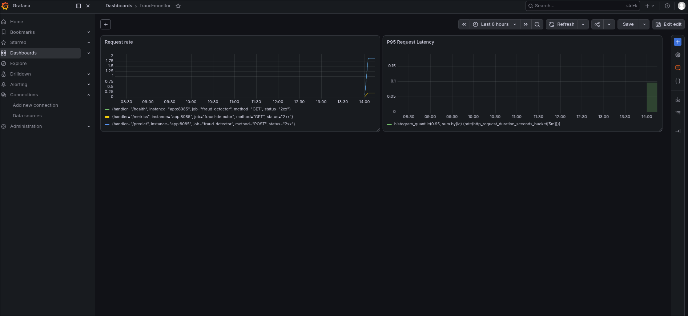
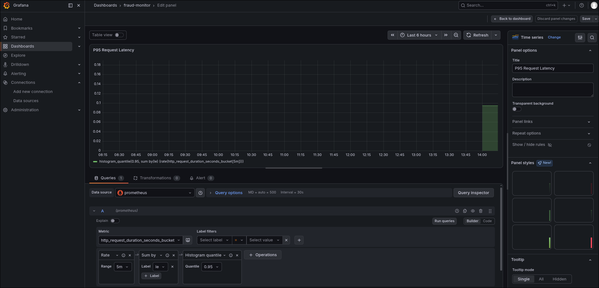
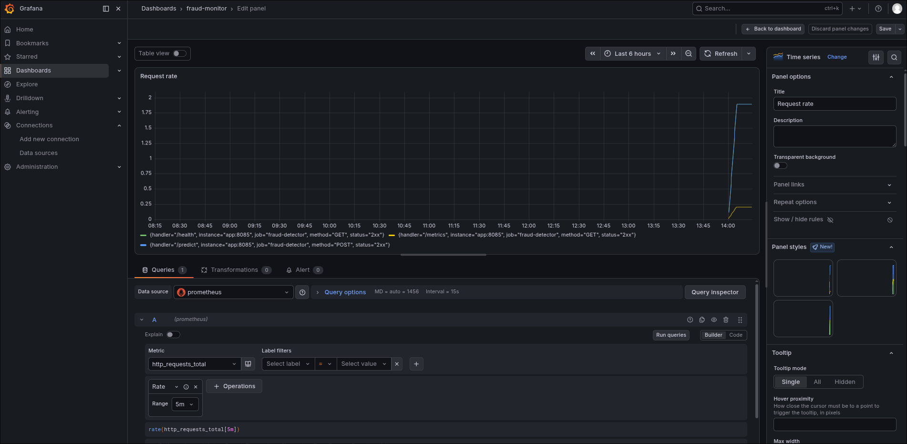
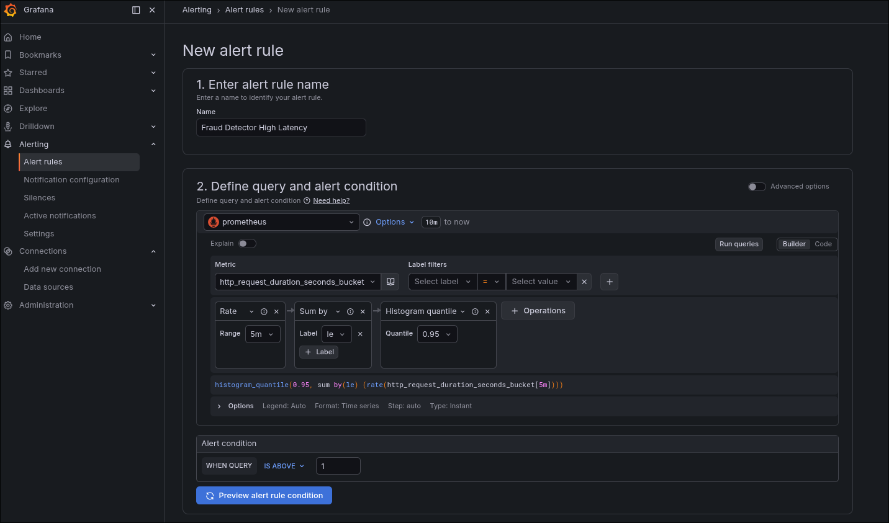
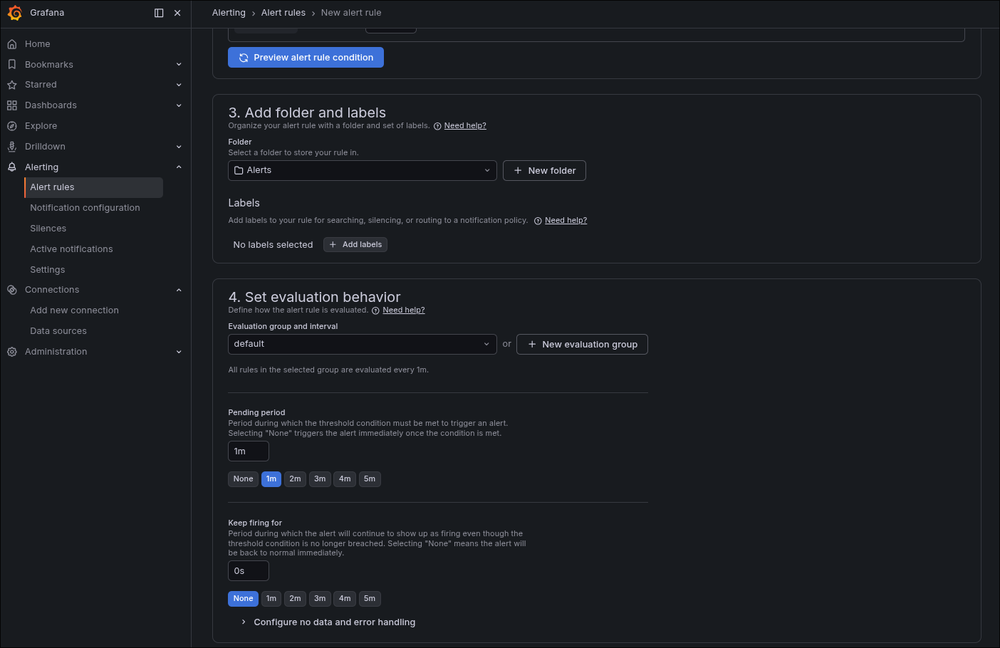

### Task

The xFusionCorp Industries MLOps team is closing the loop on the fraud-detector with a single observability pane: oncall needs to see request rate and latency at a glance, and be alerted when the service misbehaves. The service is already instrumented, Prometheus is already scraping it, and synthetic traffic is being generated in the background. Grafana was provisioned empty — no data source, no dashboards, no alerts. Your task is to wire Grafana to Prometheus, author a multi-panel `fraud-monitor` dashboard, and add an alert rule on the service.

1. The Grafana (port `3000`, log in with `admin` / `admin`) and **Prometheus** (port `9090`) buttons at the top of the lab open the relevant UIs. The pre-staged state:
   - The FastAPI app on `:8085` exposes Prometheus metrics at `/metrics`: `http_requests_total` (request counter) and `http_request_duration_seconds` (latency histogram).
   - Prometheus on `:9090` scrapes the app every 5 s as job `fraud-detector`.
   - A background traffic generator hits `/predict` and `/health` continuously, so non-zero samples are already flowing.
   - Grafana on `:3000` has no data source, no dashboards, and no alert rules. It reaches Prometheus at `http://prometheus:9090`.

2. The end state must include:
   - Grafana has a data source of type `prometheus` pointed at `http://prometheus:9090`.
   - Grafana has a dashboard named `fraud-monitor` with **at least two panels** — one querying `http_requests_total`, one querying `http_request_duration_seconds`.
   - Grafana has **at least one alert rule** whose query references a service metric.

The Compose stack lives under `/root/code/observability/` (`app/`, `compose.yaml`, `prometheus.yml`, `scripts/`) for transparency; nothing under that directory needs to be edited. Observability is two halves — a dashboard answers 'what is happening?' and an alert answers 'when should a human care?'.

### Solution

- Log into Grafana.

- Add prometheus as a data source.

  ```
  Connections -> Add new connection -> Prometheus -> Add new data source
  ```

  with Prometheus server url as `http://prometheus:9090`.

- Create the dashboard.

  ```
  Dashboards -> Create dashboard
  ```

  

  <br />

  

  <br />

  

- Create alert rule.

  ```
  Alerting -> Alert rules -> Add new alert rule
  ```

  

  <br />

  

  <br />

  Use `empty` contact point or create one.
