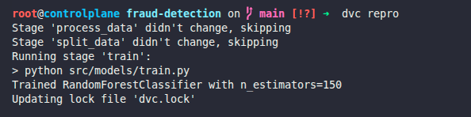

### Task

The xFusionCorp Industries ML team manages model hyperparameters through `params.yaml` so experiments can vary without code changes. The fraud-detection project's `train` stage already wires `params.yaml` for `n_estimators`, but `dvc repro` currently fails. Correct the parameter wiring and demonstrate that DVC re-runs the train stage when the parameter changes.

1. A project exists at `/root/code/fraud-detection/` with a three-stage DVC pipeline (`process_data`, `split_data`, `train`) and a `params.yaml` already in place. Do not modify the Python files.

2. The `train` stage in `dvc.yaml` references the `n_estimators` parameter. Every name listed under `params:` must resolve to a key in `params.yaml`.

3. Review `params.yaml`, correct whatever prevents `dvc repro` from completing, and run the full pipeline.

4. Demonstrate that DVC tracks parameter changes by updating `n_estimators` to a different value (for example `200`). Run `dvc repro` again—only the `train` stage should re-execute, the new value must be recorded in `dvc.lock`, and `models/model.pkl` must be regenerated.

The DVC extension's **PARAMS** section under the DVC view will surface the values from `params.yaml` directly in the editor.

### Solution

- Change directory

  ```bash
  cd fraud-detection
  ```

- Update the `params.yaml`

  ```
  n_estimators: 100
  ```

- Run the pipeline and verify

  ```bash
  dvc repro
  ```

- Update the `n_estimators` parameter and run the pipeline and verify that only the `train` stage re-executes

  E.g. `params.yaml`

  ```
  n_estimators: 100
  ```

  ```bash
  dvc repro
  ```

  Output

  

  <br />

- Check for value of `n_estimators` in `dvc.lock` and verify it matches the update value. (in this case 150)
