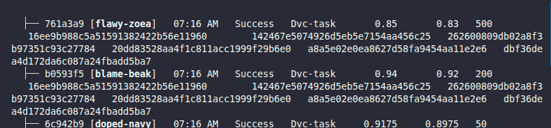

### Task

The xFusionCorp Industries data science team compares multiple training runs with different hyperparameters using DVC experiments. Run three experiments that vary the `n_estimators` hyperparameter, identify the best-performing one, and promote it to the tracked workspace.

1. A project exists at `/root/code/fraud-detection/` with a parameterised DVC pipeline already in place. `params.yaml` contains `n_estimators: 100` and the baseline pipeline has been run once.

2. Run three DVC experiments, each with a different value for `n_estimators` across a reasonable range (for example `50`, `200`, and `500`). Each experiment should produce a fresh `metrics.json`.

3. Compare the experiments and choose the one whose `f1_score` is the highest.

4. Apply the chosen experiment to the workspace so its `n_estimators`, `metrics.json`, and `models/model.pkl` become the tracked state.

The DVC extension's **EXPERIMENTS** section under the DVC view lists every experiment alongside its parameters and metrics, supports running fresh experiments through the `+` action, and applies a selected experiment to the workspace from the right-click menu—every operation in this lab can be performed either through the extension UI or with the equivalent `dvc exp` commands.

### Solution

- Change directory

  ```bash
  cd fraud-detection
  ```

- Run the experiment multiple times

  ```bash
  dvc exp run --set-param n_estimators=50
  dvc exp run --set-param n_estimators=200
  dvc exp run --set-param n_estimators=500
  ```

  or run using queue

  ```bash
  dvc exp run --queue --set-param n_estimators=50,200,500
  dvc exp run --run-all
  ```

- After running the experiments, compare them and select the one with the highest `f1_score`

  ```bash
  dvc exp show
  ```

  

- Apply the chose experiment

  ```bash
  dvc exp apply <experiment-name>
  ```

  In this case

  ```bash
  dvc exp apply b0593f5
  ```
