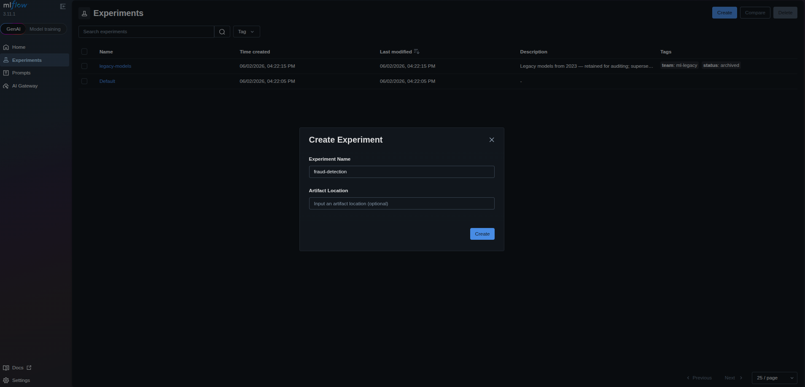
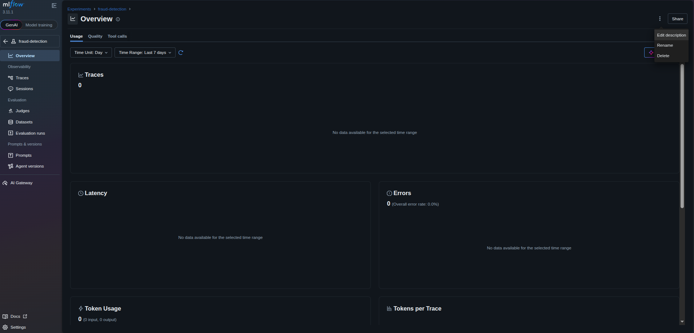
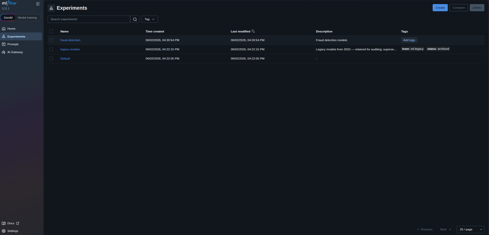
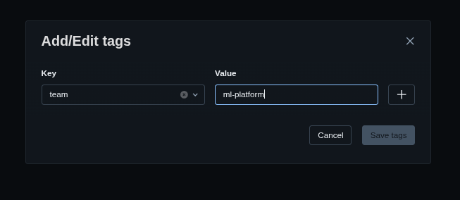
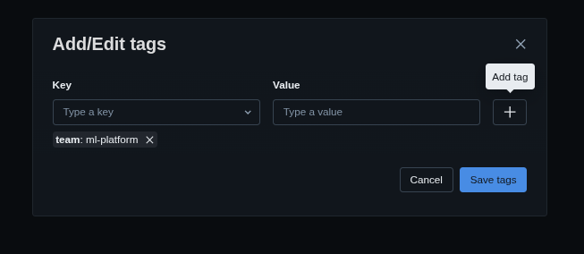
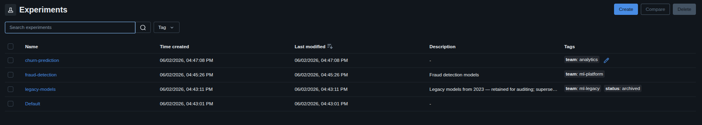

### Task

The xFusionCorp Industries ML platform team is onboarding two new ML projects and needs each one organised under its own MLflow experiment rather than sharing the `Default` experiment. Your task is to register both experiments through the **MLflow UI** and tag them with the owning team.

1. The MLflow tracking server is already running on port `5000`. The **MLflow UI** button at the top of the lab can be opened to view the dashboard. One seeded experiment (`legacy-models`) is listed alongside the platform-created `Default`—both act as reference material and must not be modified.

2. Using the MLflow UI, register two new experiments with the experiment-level metadata below. The task is complete when both records satisfy every bullet.
   - `fraud-detection`
     - Experiment-level description is a non-empty string describing the project (any phrasing).
     - Experiment-level tag: key `team`, value `ml-platform`.

   - `churn-prediction`
     - Experiment-level tag: key `team`, value `analytics`.

The result can be confirmed in the **MLflow UI**: both new experiments appear in the left-hand list, with the description and tags visible on each experiment's pa

### Solution

- Go to the MLflow UI and on the experiments tab, click create.

- Then click `+`.

  

   

- Add description

  

   

- Add tag

  
  
  

   

- Do the same for `churn-prediction` but without a description

- Verify the output

  
