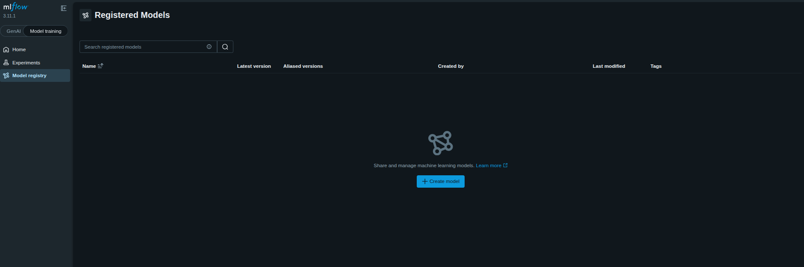
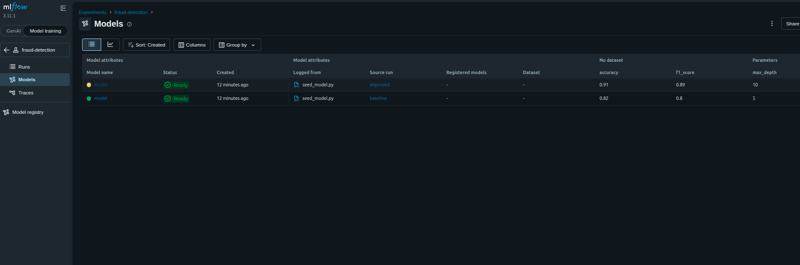
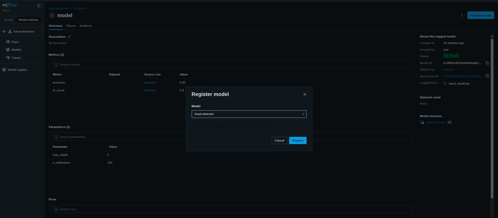
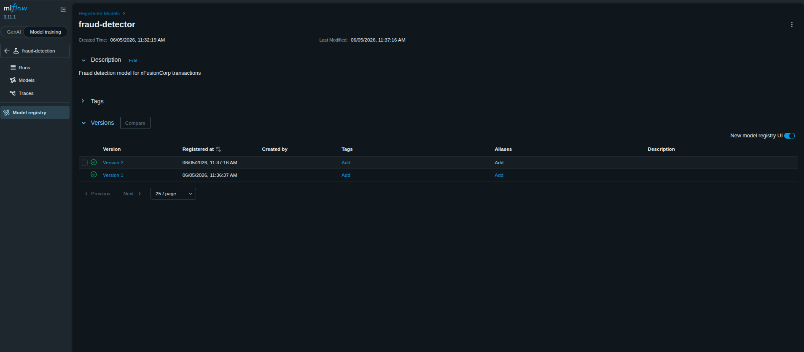
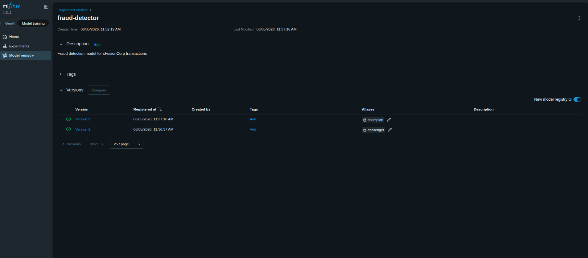

### Task

The xFusionCorp Industries ML platform team needs two trained candidates promoted through the **MLflow Model Registry** so the ops side can track which model version is serving production traffic. Both runs already exist in the `fraud-detection` experiment. Your task is to register both as versions of a new `fraud-detector` model, add a model-level description, and assign `challenger` and `champion` aliases—all through the MLflow UI.

1. The MLflow tracking server is already running on port `5000` and two runs are pre-populated in the `fraud-detection` experiment: a `baseline` run (`n_estimators=100`, `max_depth=5`, `f1_score=0.80`) and an improved run (`n_estimators=200`, `max_depth=10`, `f1_score=0.89`). Both runs can be opened via the **MLflow UI** button → `fraud-detection` experiment.

2. Using the MLflow UI, reach the end state below. The order (baseline first, improved second) matters because MLflow assigns version numbers sequentially within a registered model.
   - A registered model named `fraud-detector` exists in the Model Registry.
   - The registered model carries a non-empty description that references the word `fraud` (any phrasing; for example `Fraud detection model for xFusionCorp transactions`).
   - **Version 1** of `fraud-detector` is the baseline run and carries the alias `challenger`.
   - **Version 2** of `fraud-detector` is the improved run and carries the alias `champion`.

The result can be confirmed by opening Model registry → fraud-detector in the MLflow UI. Two versions are listed, the description is shown at the top of the model page, and the alias column (or the Aliases field on each version) indicates `challenger` on v1 and `champion` on v2.

### Solution

- Go to `Model registry` UI

  ```
  Model training -> Model registry
  ```

  

  <br />

- Create a model name `fraud-detector`

- Add description for that model

  ```
  Click on the created model -> Description -> Edit
  ```

- Register models

  ```
  Experiments -> fraud-detection -> Models
  ```

  

  <br />

- First add `baseline` and then `improved`. This ensures the correct versioning

  Click on the model and then `Register model`

  

  <br />

- Add aliases from the `Model registry` UI

  

  <br />

- Verify the output

  
