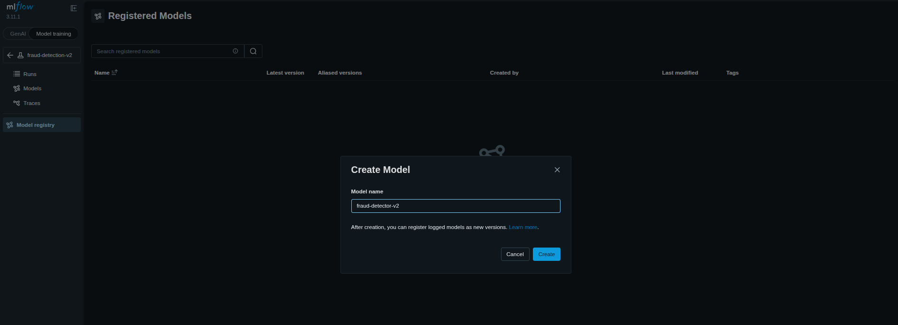
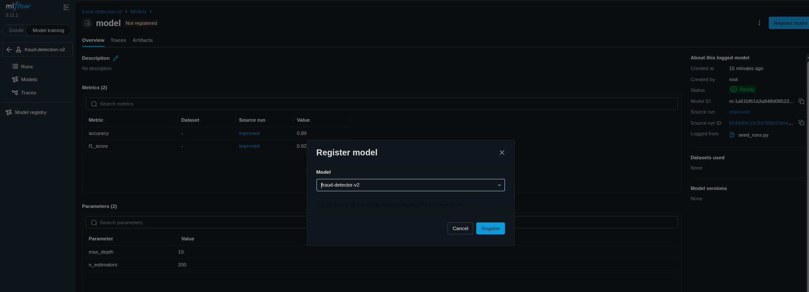
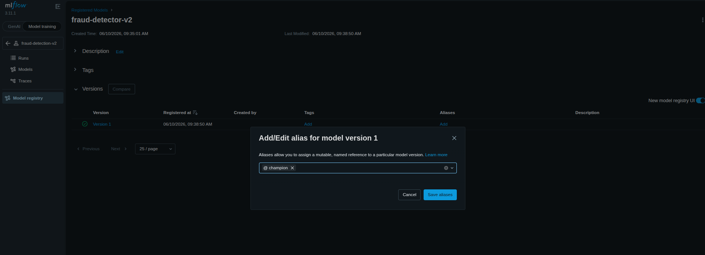

### Task

The xFusionCorp Industries MLOps team needs the `fraud-detection-v2` candidate promoted all the way from the tracking server to live inference and monitored end to end. The backing stack (PostgreSQL, SeaweedFS, MLflow tracking server, three candidate runs) is already in place. Your task is to cover the remaining lifecycle work: model promotion, serving, and health monitoring.

1. The infrastructure is fully up: PostgreSQL container `mlflow-db` on port `5432`, SeaweedFS on ports `8333` (S3 API) and `8888` (Filer UI), MLflow tracking server on port `5000` with the PostgreSQL backend and the `mlflow-artifacts` S3 bucket. The `fraud-detection-v2` experiment contains three candidate runs (`baselinej`, `improved`, `regression`) with logged `f1_score` metrics. The **MLflow UI** and **SeaweedFS Filer** buttons at the top of the lab can be opened to view each web UI.

2. The complete end state requires the following.
   - A registered model named `fraud-detector-v2` exists in the MLflow Model Registry.
   - A `champion` alias on that model points at the version sourced from the `fraud-detection-v2` run with the highest `f1_score`.
   - An `mlflow models serve` process listens on port `5001`, serving the champion version (`--env-manager=local` is the supported choice for the lab). Export `MLFLOW_TRACKING_URI=http://localhost:5000` in the serving shell so the `models:/` URI can be resolved against the tracking server. The tracking server proxies the model download from SeaweedFS itself, so no S3 credentials are needed in the serving shell.
   - The served endpoint returns `200` on `GET /health`.
   - A shell script at `/root/code/monitor.sh` exists, is executable, probes the served model's `/health` endpoint once, and exits with status `0` when the endpoint is healthy.

3. The top run can be identified either through the **MLflow UI** Compare view or with a one-off `MlflowClient.search_runs()` call—whichever is preferable. The registration and alias assignment are likewise available from the UI (Models tab) or the SDK.

`mlflow models serve` is long-running; start it in the background, and ensure that the new process is listening on port `5001` before writing the monitoring script.

### Solution

- Visit the **MLflow UI**

- Create a new model from the `Model registry`

  ```
  Model training -> Model registry
  ```

  

  <br />

- Register the model with the highest `f1_score` to `fraud-detector-v2`. In this case its `improved` model.

  ```
  Model training -> Models -> Click on model -> Register model
  ```

  

  <br />

- Add the alias `champion` for the registered model.

  ```
  Model training -> Model registry -> fraud-detector-v2 -> Add alias to the version 1
  ```

  

  <br />

- Serve the model

  In the terminal

  ```bash
  export MLFLOW_TRACKING_URI=http://localhost:5000

  nohup mlflow models serve \
    -m "models:/fraud-detector-v2@champion" \
    --host 0.0.0.0 \
    --port 5001 \
    --env-manager local \
    > /tmp/fraud-serve.log 2>&1 &
  ```

- Verify the served endpoint return `200` response

  ```bash
  curl -i http://localhost:5001/health
  ```

- Create `/root/code/monitor.sh` and paste the content in `root/code/monitor.sh.template`

  ```bash
  #!/usr/bin/env bash
  set -u
  if curl -sf -o /dev/null http://localhost:5001/health; then
    echo "healthy"
    exit 0
  fi
  echo "unhealthy"
  exit 1
  ```

  Make the file executable

  ```bash
  chmod +x /root/code/monitor.sh
  ```

- Execute and verify the script

  ```bash
  /root/code/monitor.sh
  echo $?
  ```

  Output should be `0`
