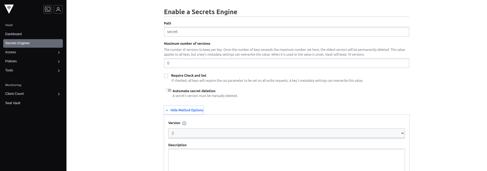
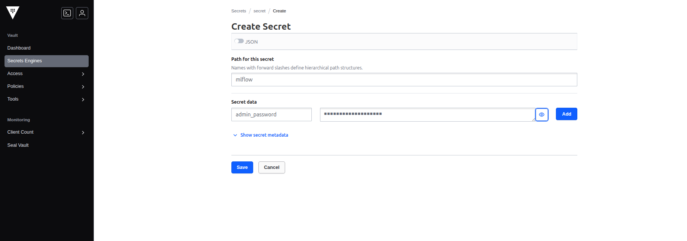
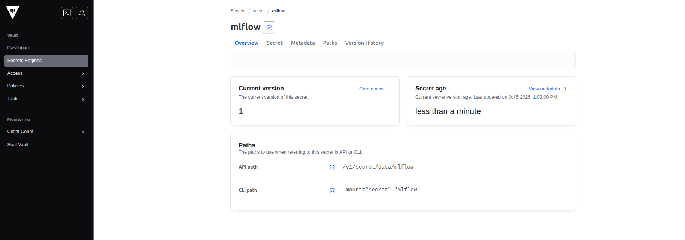

### Task

The xFusionCorp Industries ML platform team wants every credential that a lab-ops service needs—MLflow's admin password today, SeaweedFS's access keys and PostgreSQL passwords later—to come out of HashiCorp Vault at service-start time rather than be hardcoded into a startup script. A dev Vault is already running on port `8200`, its web UI is reachable via the Vault button, and an MLflow boot wrapper on the host is polling Vault every 5 s for `secret/mlflow.admin_password—but` the wrapper can only launch MLflow once that KV entry exists. Your task is to enable the KV v2 engine in Vault, create the secret, and watch MLflow come up on port `5000`.

1. The Vault UI is on port `8200` (**Vault** button opens the login page). The dev-mode root token is pre-created and written to `/root/code/vault-token`; paste the file's contents into the Vault Token login field. (Production deployments would use userpass / AppRole / OIDC instead, but the root token is the shortest path for a dev server.)

2. The MLflow wrapper picks up the new KV entry within ~5 s and execs `mlflow server` on port `5000`. The **MLflow UI** button then opens the live tracker.

3. The end state must include:
   - A KV v2 secrets engine is enabled at path `secret/` — `GET /v1/sys/mounts` returns `secret/` with `type: kv` and `options.version: "2"`.
   - The secret at path `secret/mlflow` carries a non-empty `admin_password` key — `GET /v1/secret/data/mlflow` (with the root token) returns a JSON body whose `data.data.admin_password` is a non-empty string.
   - `GET http://localhost:5000/` answers `200` – MLflow is running because the wrapper found the password.

Running services should not know their own secrets at image-build time. A Vault-first pattern lets you rotate a credential in Vault and restart the consumer to pick up the new value—no rebuild, no config patch, no secret in the commit history. This lab's single-service wrapper is the minimum viable version of that pattern; a real deployment replaces the root token with an AppRole login and adds audit logging.

### Solution

- Login to the **Vault** using the root token. Get the root code using

  ```bash
  cat /root/code/vault-token
  ```

- Create a new secretes engine

  ```
  Secrets Engines -> Enable new engine -> Select KV
  ```

  

- Create a secret

  ```
  Go to the created secret engine -> Create secret
  ```

  Give a password

  

  

- Verify that the **MLflow UI** is reachable by clicking on the **MLflow UI** button
