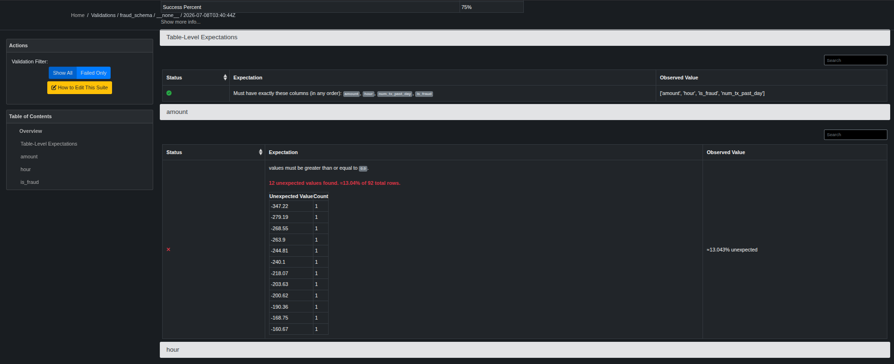

### Task

The xFusionCorp Industries ML platform team extended the `fraud_schema` suite to a second `batch—data/transactions_drifted.csv`, a week's worth of real production rows. The `drift_check` checkpoint runs the existing suite against this file and fails on its first run. Your task is to use Data Docs to diagnose which expectation failed and why, widen the offending bound in the fix-script, re-run the checkpoint, and confirm Data Docs goes green.

1. Open the Data Docs button (port `8081`). The landing page lists two past validation runs under `fraud_schema`:
   - `default` – Green (against the clean `transactions.csv`).
   - `drift_check` – red (against the drifted file).

   Click into the red `drift_check` run. The failing expectation's row names the column and bound; the Observed Values section shows the actual batch statistics—enough to pick a widened bound.

2. Open `/root/code/dataquality/fix_drift.py` in the VS Code editor. The four expectations are already in the script; one of them carries the bound Data Docs flagged. Widen it so the expectation admits the observed values with a little headroom. Do not delete other expectations; the fix is a widening, not a deletion.

3. Run the script:

   ```python3
   python3 /root/code/dataquality/fix_drift.py
   ```

   The script re-persists the suite and re-executes the `drift_check` checkpoint. Expected output ends with `Checkpoint` drift_check `result: success=True`.

4. Refresh Data Docs. The most recent `drift_check` run is now green; every expectation pill reads `Success`.

5. The end state must include:
   - The `drift_check` checkpoint is still present in `gx/checkpoints/`.
   - `gx/expectations/fraud_schema.json` still has all four core expectation types (the fix is a widening, not a deletion).
   - The most recent validation JSON under `gx/uncommitted/validations/` for checkpoint `drift_check` reports `success: true`.

The failing-validation page is the core debug surface for data-quality incidents: it tells you WHICH expectation failed, WHAT was observed, and by how much. A real team uses that same signal to decide whether the data genuinely drifted (update the rule) or whether the data is broken (fix upstream). Either way, the read-the-evidence step comes first.

### Solution

- Follow the step 1 and identify the required minimum value so that the legitimate refunds stop being flagged.

  

  `-400` seems appropriate for this scenario

- Update the script `/root/code/dataquality/fix_drift.py`

  ```python3
  """Re-author the fraud_schema suite and re-run the drift_check checkpoint.

  Startup has already populated the ``fraud_schema`` suite with the
  baseline four expectations AND generated ``data/transactions_drifted.csv``.
  A ``drift_check`` checkpoint runs the same suite against the drifted
  file -- on first spawn it fails because a handful of rows legitimately
  carry negative amounts (refunds the business now allows but that the
  original guard rejects).

  The fix: widen the ``amount`` lower bound so the guard matches the
  updated business reality. The minimum accepted value below is still
  ``0`` -- change it.
  """
  from __future__ import annotations

  import great_expectations as gx
  import great_expectations.expectations as ge

  PROJECT_ROOT = "/root/code/dataquality"   # GE creates <root>/gx/ as home
  SUITE_NAME = "fraud_schema"
  CHECKPOINT_NAME = "drift_check"


  def main() -> None:
      context = gx.get_context(mode="file", project_root_dir=PROJECT_ROOT)

      # Self-healing: if the startup scaffold skipped the suite for any
      # reason, add_or_update still returns a fresh empty one.
      suite = context.suites.add_or_update(
          gx.ExpectationSuite(name=SUITE_NAME),
      )
      suite.expectations = []  # re-author cleanly each run

      suite.add_expectation(
          ge.ExpectTableColumnsToMatchSet(
              column_set=["amount", "hour", "num_tx_past_day", "is_fraud"],
          )
      )

      # TODO: widen this lower bound so legitimate refunds stop being
      #       flagged. Pick a value that admits the drifted batch's
      #       observed minimum (see the failing-validation page on Data
      #       Docs for the observed values) with a little headroom.
      suite.add_expectation(
          ge.ExpectColumnValuesToBeBetween(column="amount", min_value=-400)
      )

      suite.add_expectation(
          ge.ExpectColumnValuesToBeBetween(
              column="hour", min_value=0, max_value=23,
          )
      )
      suite.add_expectation(
          ge.ExpectColumnValuesToBeInSet(column="is_fraud", value_set=[0, 1])
      )

      context.suites.add_or_update(suite)
      print(f"Persisted {len(suite.expectations)} expectations to `{SUITE_NAME}`")

      checkpoint = context.checkpoints.get(name=CHECKPOINT_NAME)
      result = checkpoint.run()
      print(f"Checkpoint `{CHECKPOINT_NAME}` result: success={result.success}")


  if __name__ == "__main__":
      main()
  ```

- Run the script

  ```bash
  python3 /root/code/dataquality/fix_drift.py
  ```

- Verify all the expectations are successfull by refreshing the **Data Docs**.
