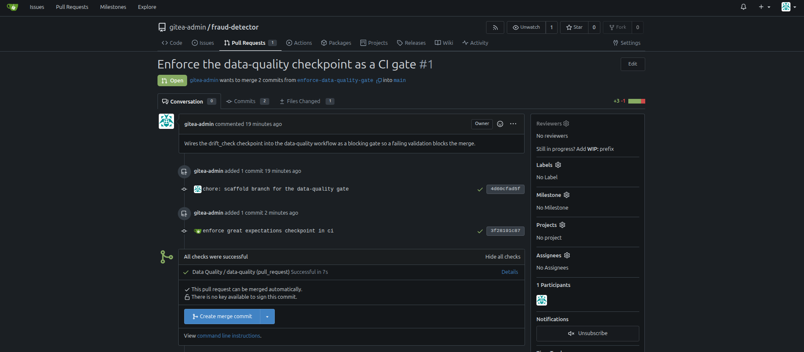

### Task

The xFusionCorp Industries ML platform team runs the `drift_check` Great Expectations checkpoint on the `fraud-detector` repository; however, it is currently not enforced in the continuous integration (CI) process. The `data-quality` workflow installs Great Expectations but does not execute the checkpoint, which means that a pull request that introduces data drift could potentially be merged without any checks. A teammate has already submitted a pull request to integrate the checkpoint into the workflow. Your objective is to configure the checkpoint as a **blocking merge gate**: ensure that the `data-quality` job executes `python3 -m src.gx_run` as a standard (non-`continue-on-error`) step, so that if the checkpoint fails, the job will also fail, thereby preventing the merge.

The Gitea UI is on port `3000` (**Gitea** button). Admin credentials: `gitea-admin` / `gitea2026`. The repo is at `http://localhost:3000/gitea-admin/fraud-detector` and a working clone is at `/root/code/fraud-detector`, already checked out on branch `enforce-data-quality-gate`. The PR is pre-opened.

The current `data-quality` job in `.gitea/workflows/data-quality.yml` checks out the repo and installs `great_expectations`, `pandas`, `numpy`—but does not run the checkpoint. `src/gx_run.py` bootstraps the GE project in-workspace, runs the `drift_check` checkpoint against `data/transactions.csv`, and **exits non-zero when the data violates** the suite. A blocking step that invokes `python3 -m src.gx_run`, pushed to the `enforce-data-quality-gate` branch, turns the checkpoint into a real merge gate.

The end state must include:

- The `data-quality` job has a step whose command runs `python3 -m src.gx_run`.
- That step is **blocking**: no `continue-on-error: true`, and no `|| true /` ; `true`-style suffix that would swallow a failure.
- The PR head commit's combined status reaches `success` (the current `transactions.csv` is clean, so the gate passes).

A CI check that runs but is marked `continue-on-error` (or whose command swallows its exit code) is not a gate—bad data merges anyway. The gate is only real when a failing checkpoint fails the job. The grader proves this by running the checkpoint against a deliberately bad row and confirming it exits non-zero.

### Solution

- Update the `.gitea/workflows/data-quality.yml`

  ```yml
  name: Data Quality

  on:
    pull_request:
      branches: [main]
    push:
      branches: [main]

  jobs:
    data-quality:
      runs-on: ubuntu-latest
      steps:
        - uses: actions/checkout@v4

        - name: Install Great Expectations
          run: |
            pip install --break-system-packages \
              great_expectations pandas numpy

        # TODO: add the data-quality GATE step here. Run the drift_check
        #       checkpoint with:  python3 -m src.gx_run
        #   `src/gx_run.py` exits non-zero when the checkpoint fails, so as
        #   an ordinary step its failure fails the job and BLOCKS the merge —
        #   that is the gate. Do NOT add `continue-on-error:` to the step and
        #   do NOT append `|| true` / `; true` to the command: either one lets
        #   a failing checkpoint pass, so bad data would merge anyway.
        - name: Run Great Expectations drift check
          run: python3 -m src.gx_run
  ```

- Commit and push the changes

  ```bash
  cd fraud-detector
  git add .gitea/workflows/data-quality.yml
  git commit -m "enforce great expectations checkpoint in ci"
  git push origin enforce-data-quality-gate
  ```

- Login in to the gitea UI and verify the PR head commit's combined status reaches success

  
