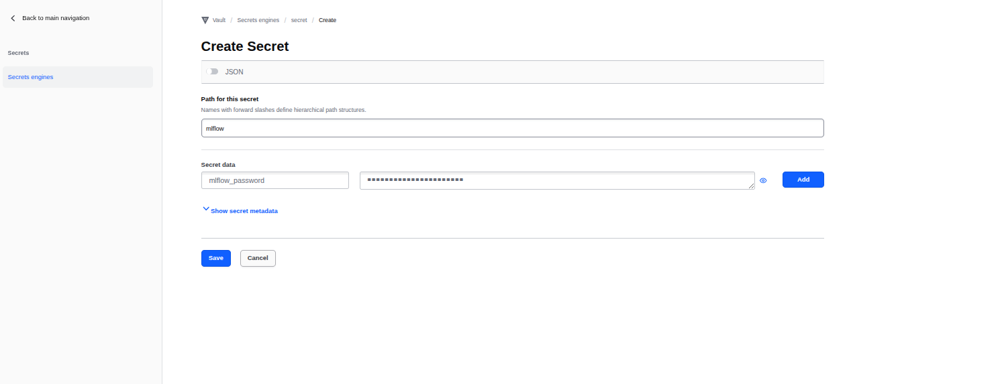
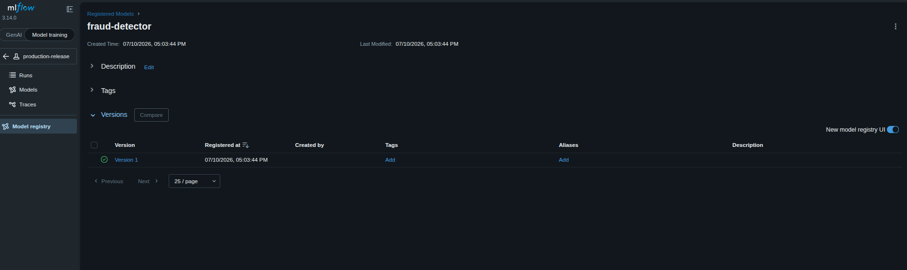
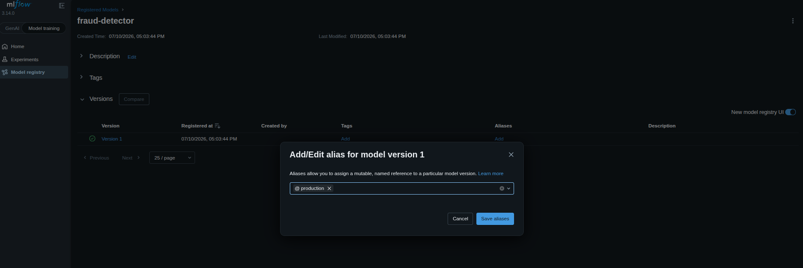

### Task

The xFusionCorp Industries ML platform team is preparing to cut their first end-to-end release of the `fraud-detector` repository. This release comprises a three-job Gitea Actions workflow that includes: pulling the MLflow credential from Vault, verifying data quality by gating on a Great Expectations checkpoint, and registering the trained model in MLflow. All four services—Vault, MLflow, Gitea, and the Actions runner—are operational. However, the first job of the workflow remains incomplete, as the step for reading from Vault is noted as a TODO. Your final task is to complete this section by scripting the step to pull the MLflow credential from Vault, and subsequently, execute the release across its various user interfaces: staging the credential in Vault, initiating and merging a pull request in Gitea, and promoting the registered model in MLflow.

Each of the four UIs has a button at the top of the lab:

- Gitea (port `3000`) – `gitea-admin` / `gitea2026`. The `fraud-detector` repo sits on `main`; a feature branch `production-release` is pre-pushed. No pull request has been opened yet.
- **Vault** (port `8200`) – log in with the token at `/root/code/vault-token`. The KV v2 engine is enabled at `secret/`; `secret/mlflow` is empty.
- **MLflow UI** (port `5000`) – the **Models** page is empty.
- **Data Docs** – rendered by the `data-quality` job once the workflow runs.

The workflow at `.gitea/workflows/production.yml` on the `production-release` branch has three jobs (`fetch-secret` → `data-quality` → `register-model`). The `data-quality` and `register-model` jobs are complete; the `fetch-secret` job's Vault-read step is left as a `# TODO` in the working clone at `/root/code/fraud-detector`. The workflow reads a Vault KV key, runs the `schema_check` GE checkpoint, and registers the trained model as `fraud-detector` in MLflow; it only triggers on `pull_request` against `main`.

The end state must include:

- `secret/mlflow` has a non-empty `mlflow_password` key (any value works).
- The `fetch-secret` job on the `production-release` branch reads the KV v2 path `secret/data/mlflow` and its `mlflow_password` key (the authored step).
- A pull request exists from `production-release` → `main` and has been merged.
- The workflow run on that PR's head commit reaches combined status `success` (all three jobs green).
- `fraud-detector` is registered in MLflow with the `production` alias pointing at one of its versions.

Each of the four pieces lives behind a different UI and, in a real team, a different owner: Vault (security), Gitea (the dev lead opening + merging the PR), MLflow (the ML engineer promoting the model), Data Docs (the data team reviewing the quality report). The capstone walks all four. Order matters for the first step: stage the Vault secret before opening the PR, otherwise the workflow's very first job fails and the reader has to re-trigger.

### Solution

- Change directory

  ```bash
  cd fraud-detector
  ```

- Update the `.gitea/workflows/production.yml`

  ```yml
  name: Production release

  on:
    pull_request:
      branches: [main]

  env:
    VAULT_ADDR: http://localhost:8200
    MLFLOW_TRACKING_URI: http://localhost:5000

  jobs:
    fetch-secret:
      runs-on: ubuntu-latest
      steps:
        - uses: actions/checkout@v4

        - name: Read MLflow password from Vault
          run: |
            # TODO: read the MLflow credential from Vault and fail this
            #       job if it is missing, so the release cannot proceed
            #       without the secret. Notes:
            #         - the dev-mode token is at /root/code/vault-token
            #         - the secret is at KV v2 path secret/data/mlflow,
            #           key mlflow_password ($VAULT_ADDR is set above)
            #       Author these steps in place of the two lines below:
            #         1. read the token from /root/code/vault-token
            #         2. GET $VAULT_ADDR/v1/secret/data/mlflow with an
            #            X-Vault-Token header; extract
            #            .data.data.mlflow_password
            #         3. if it is empty, echo an ::error:: line and exit 1
            #         4. otherwise echo a ::notice:: confirming the fetch
            #            (print the length, never the password itself)
            TOKEN=$(cat /root/code/vault-token)

            PASSWORD=$(
              curl -fsS \
                -H "X-Vault-Token: ${TOKEN}" \
                "$VAULT_ADDR/v1/secret/data/mlflow" \
              | jq -r '.data.data.mlflow_password // empty'
            )

            if [ -z "$PASSWORD" ]; then
              echo "::error::mlflow_password is missing from secret/data/mlflow"
              exit 1
            fi

            echo "::notice::Fetched MLflow password from Vault"

    data-quality:
      runs-on: ubuntu-latest
      needs: fetch-secret
      steps:
        - uses: actions/checkout@v4
        - name: Install Great Expectations
          run: pip install --break-system-packages great_expectations pandas numpy
        - name: Run schema checkpoint
          run: python3 -m src.gx_run --checkpoint schema_check

    register-model:
      runs-on: ubuntu-latest
      needs: data-quality
      steps:
        - uses: actions/checkout@v4
        - name: Install deps
          run: pip install --break-system-packages mlflow numpy scikit-learn pandas
        - name: Register model
          env:
            VAULT_KEY_USED: mlflow_password
          run: python3 -m src.register
        - name: Assert a version exists in the registry
          run: |
            python3 -c "
            import mlflow
            mlflow.set_tracking_uri('$MLFLOW_TRACKING_URI')
            client = mlflow.tracking.MlflowClient()
            rm = client.get_registered_model('fraud-detector')
            assert rm.latest_versions, 'fraud-detector has no versions'
            print('Registered model versions:', [v.version for v in rm.latest_versions])
            "
  ```

- Create secret

  ```
  Vault -> Login -> Secrets -> Secret Engines -> secret -> Create secret
  ```

  

- Commit the workflow changes

  ```bash
  git add .gitea/workflows/production.yml
  git commit -m "implement vault secret retrieval"
  git push origin production-release
  ```

- Open a PR for the changes and wait for the checks to be all successful and merge the PR.

- Add alias `production` for the `fraud-detector` model registered on mlflow

  ```
  MLflow UI -> Model Training -> Model registry -> fraud-detector -> Add alias
  ```

  

  <br />

  
