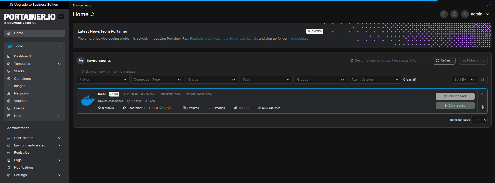
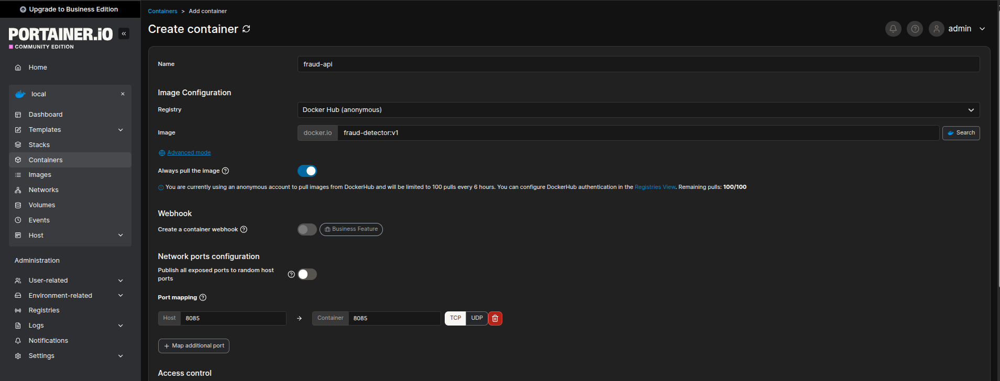
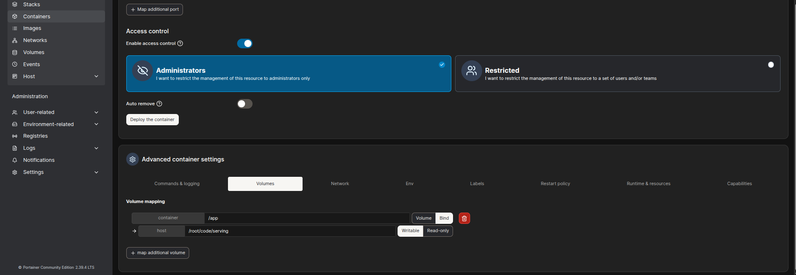
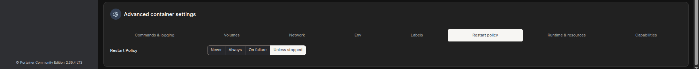
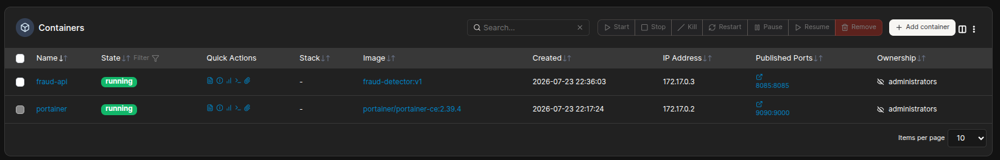

### Task

The xFusionCorp Industries ML platform team utilizes Portainer to manage every model-serving container. This operational layer allows for image inspection, container deployment, and runtime log management from a single web console. The `fraud-detector:v1` image has been successfully built, and Portainer is currently accessible on port `9090`.

Your task is to deploy the serving container named `fraud-api` using the Portainer UI. You are required to bind-mount the pre-staged `/root/code/serving/` directory to ensure the container can locate `app.py` and `model.pkl`. Additionally, you must publish the host port `8085` and verify that the endpoints `/health` and `/predict` respond correctly on the host.

1. Portainer is already running on port `9090`. The **Portainer UI** button at the top of the lab opens the login page. Admin credentials: username `admin`, password `xFusionCorp2026!` (pre-initialised at startup). The deploy is driven entirely from Portainer's **Add container** form in the local environment.

2. The project layout under `/root/code/serving/`:
   - `app.py` – FastAPI app loading `/app/model.pkl` and exposing `/health` + `POST /predict`. Correct.
   - `Dockerfile` – `python:3.11-slim` + fastapi + uvicorn + joblib + sklearn, `EXPOSE 8085`, `CMD ["uvicorn", "app:app", ...]`. Correct.
   - `model.pkl` – RandomForest trained at startup.

3. The image `fraud-detector:v1` has already been built from the Dockerfile. The container is expected to bind-mount `/root/code/serving/` → `/app` so the same image picks up new `app.py` or `model.pkl` versions on restart, and to publish host port `8085` → container `8085`.

4. The end state must include:
   - Portainer is reachable on port `9090`.
   - `docker inspect fraud-api` reports the container as running, using image `fraud-detector:v1`, with the bind-mount `/root/code/serving` → `/app`.
   - `curl http://localhost:8085/health` returns `{"status":"ok"}` with HTTP `200`.
   - `curl -X POST http://localhost:8085/predict -H 'Content-Type: application/json' -d '{"amount":3200,"hour":23,"num_tx_past_day":5}'` returns a JSON body with an `is_fraud` field of `0` or `1`.

Portainer's **Add container** form collects every field the equivalent `docker run` command would—name, image, port mapping, volume mount, env vars, restart policy—and runs the deploy through the mounted `/var/run/docker.sock`. The host path entered in the Volumes tab must match the lab's host filesystem exactly (`/root/code/serving`).

### Solution

- Go to the **Portainer UI** and log in

- Select the `local` environment

  

- Add container

  ```
  Containers -> Add container
  ```

  Add basic info
  

  <br />

  Add the container volume settings

  

  <br />

  Add the container restart policy settings

  

  <br />

  

- Select `Deploy container`

- Verify the results

  The following should return the information about the image

  ```bash
  docker inspect fraud-api
  ```

  The following should return `{"status":"ok"}`

  ```bash
  curl http://localhost:8085/health
  ```

  The following should return `{"is_fraud":1}`

  ```bash
  curl -X POST http://localhost:8085/predict -H 'Content-Type: application/json' -d '{"amount":3200,"hour":23,"num_tx_past_day":5}'
  ```
