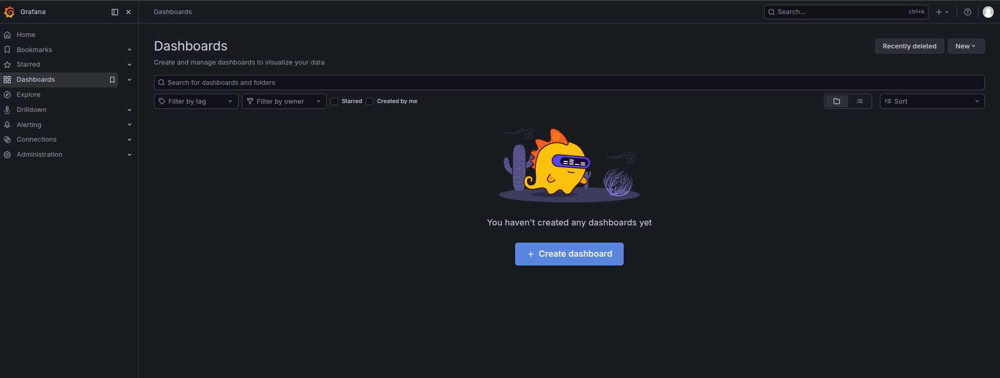
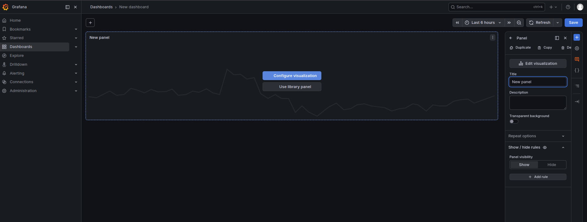
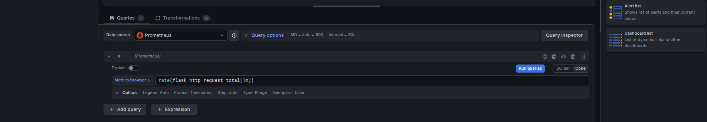
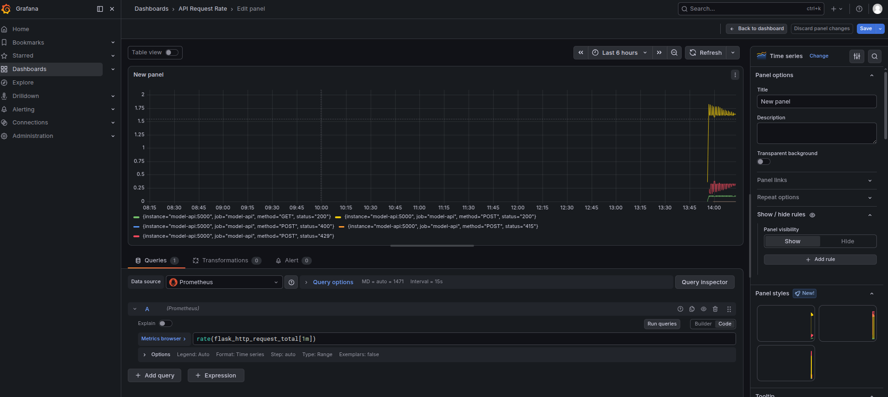

### Task

The xFusionCorp Industries ML platform team operates a fraud-detection model in production, supported by a comprehensive observability stack. This stack includes a Flask API with Prometheus instrumentation, Redis for per-IP rate limiting, nginx as the public reverse proxy, Prometheus for metrics collection, and Grafana for dashboarding. Currently, the pre-staged stack located at `/root/code/serving/production/` does not reach a clean end state. Your objective is to correct the wiring, bring the stack online, and create a Grafana dashboard that visualizes the model API's request rate.

1. The Docker daemon is already running. Every image the compose stack references is being pre-pulled in the background at startup, so `docker compose up -d` returns in seconds. The Grafana admin password is `grafana2026`.

2. Bring the stack up and observe where it falls short: `cd /root/code/serving/production && docker compose up -d && docker compose ps` shows the container states, and `docker compose logs` surfaces the wiring faults behind any container that does not settle.

3. The project layout under `/root/code/serving/production/`:
   - `app/app.py` – Flask API with `/health`, `/predict` (Redis-backed per-IP rate limit), and `/metrics` (once the exporter is wired). Needs attention.
   - `app/Dockerfile` – `python:3.11-slim` + flask + redis + prometheus-flask-exporter + joblib + sklearn. Correct.
   - `model.pkl` – Trained at startup on the shared synthetic fraud dataset.
   - `docker-compose.yml` – Defines `model-api`, `redis`, `nginx` (publishes 8085), `prometheus` (publishes 9090), `grafana` (publishes 3000, admin password `grafana2026`), and a `traffic-generator` sidecar (continuously POSTs to `/predict` so Grafana has live request-rate data to plot). Correct.
   - `prometheus.yml` – Scrape config for the `model-api` job. Needs attention.
   - `nginx.conf` – Reverse-proxy config with an `upstream model_backend block` + `location /` forwarding every request. Needs attention.
   - `grafana/provisioning/datasources/prometheus.yml` – Pre-provisions a `Prometheus` datasource pointing at `http://prometheus:9090`, so the Grafana task focuses on dashboard creation.

4. The Grafana UI button opens the console once the stack is up; the dashboard should carry at least one panel that queries the Prometheus datasource.

5. The end state must include:
   - All six containers (`model-api`, `prod-redis`, `prod-nginx`, `prod-prometheus`, `prod-grafana`, `prod-traffic`) are reported running by `docker inspect`.
   - `curl -s http://localhost:5000/metrics` returns a Prometheus exposition-format body (HTTP 200).
   - `curl -X POST http://localhost:8085/predict -d '{...}'` through nginx returns a JSON `is_fraud` response.
   - `curl http://localhost:9090/api/v1/targets` reports the `model-api` job's health as `up`.
   - `curl -u admin:grafana2026 http://localhost:3000/api/datasources` lists a `Prometheus` datasource.
   - `curl -u admin:grafana2026 http://localhost:3000/api/search?type=dash-db` returns at least one user-created dashboard, and that dashboard's JSON carries at least one panel.

The Flask app listens on container port `5000`. The prometheus-flask-exporter publishes standard HTTP request counters that a Grafana panel can query to plot the API's request rate.

### Solution

- Change directory and run docker images

  ```bash
  cd /root/code/serving/production/ && docker compose up -d && docker compose ps
  ```

- Look at logs

  ```bash
  docker compose logs
  ```

- Update `app/app.py`

  Add `PrometheusMetrics` exported

  ```python
  """Production fraud-detection serving API.

  Flask app wired with:
    - GET  /health           — liveness check.
    - POST /predict          — score one transaction; Redis-backed
                               per-IP rate limit (100 req / min).
    - GET  /metrics          — Prometheus scrape endpoint, exposed
                               by `prometheus_flask_exporter`.

  The observability stack scrapes `/metrics` every 5 seconds; the
  container listens on port 5000 inside the Docker network, and
  nginx fronts the public 8085 surface.
  """
  import joblib
  import numpy as np
  import redis
  from flask import Flask, jsonify, request
  from prometheus_flask_exporter import PrometheusMetrics

  MODEL = joblib.load("/app/model.pkl")
  REDIS = redis.Redis(host="redis", port=6379, decode_responses=True)

  RATE_LIMIT = 100
  RATE_WINDOW_SECONDS = 60

  app = Flask(__name__)
  metrics = PrometheusMetrics(app)

  @app.route("/health")
  def health():
      return jsonify({"status": "ok"}), 200


  @app.route("/predict", methods=["POST"])
  def predict():
      ip = request.remote_addr or "unknown"
      key = f"ratelimit:{ip}"
      try:
          count = REDIS.incr(key)
          if count == 1:
              REDIS.expire(key, RATE_WINDOW_SECONDS)
      except redis.RedisError:
          count = 0

      if count > RATE_LIMIT:
          return jsonify({"error": "rate limit exceeded"}), 429

      payload = request.get_json() or {}
      features = np.array([[
          float(payload.get("amount", 0.0)),
          int(payload.get("hour", 0)),
          int(payload.get("num_tx_past_day", 0)),
      ]])
      return jsonify({"is_fraud": int(MODEL.predict(features)[0])}), 200


  if __name__ == "__main__":
      app.run(host="0.0.0.0", port=5000)
  ```

- Update the target port on `prometheus.yml`

  ```yml
  global:
    scrape_interval: 5s
    evaluation_interval: 5s

  scrape_configs:
    - job_name: model-api
      static_configs:
        - targets:
            - model-api:5000
  ```

- Update the `model-api` port on `nginx.conf`

  ```
  events {}

  http {
      upstream model_backend {
          server model-api:5000;
      }

      server {
          listen 80;

          location / {
              proxy_pass http://model_backend;
              proxy_set_header Host $host;
              proxy_set_header X-Real-IP $remote_addr;
          }
      }
  }
  ```

- Restart the containers

  ```bash
  docker compose up -d --build
  ```

- Create a dashboard
  Log into grafana

  ```
  Grafana -> Dashboards -> Create dashboard
  ```

  

  <br />

  Add panel

  

  <br />

  Configure visualization -> Add query

  

  <br />

  Save

  

- Verify the results

  The following returns a Prometheus exposition-format body

  ```bash
  curl -s http://localhost:5000/metrics
  ```

  The following returns `{"is_fraud":0}`

  ```bash
  curl -X POST http://localhost:8085/predict -H 'Content-Type: application/json' -d '{}'
  ```

  `curl http://localhost:9090/api/v1/targets` reports the model-api job's health as up.

  `curl -u admin:grafana2026 http://localhost:3000/api/datasources` lists a Prometheus datasource.

  `curl -u admin:grafana2026 http://localhost:3000/api/search?type=dash-db` returns at least one user-created dashboard, and that dashboard's JSON carries at least one panel.
