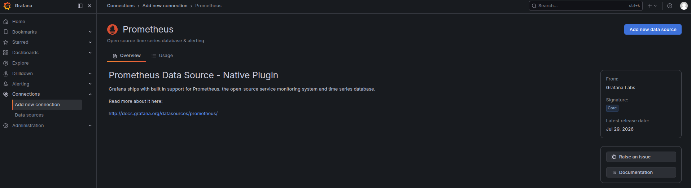
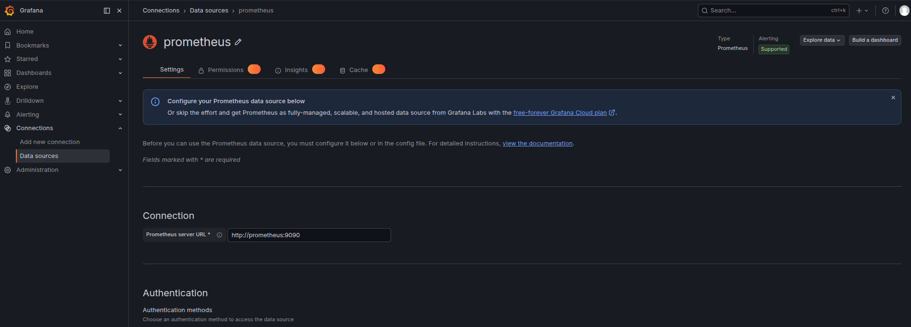
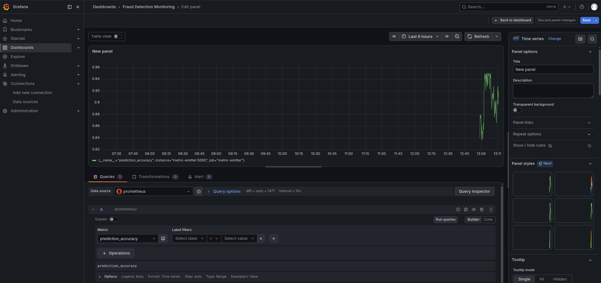

### Task

The xFusionCorp Industries ML platform team is in the process of implementing Grafana-based monitoring for their fraud-detection model. Although Prometheus and Grafana are already running in Docker, alongside a Flask metric emitter that provides live ML signals, Grafana currently lacks a configured data source, preventing the UI from accessing any metrics.

Your objective is to access the Grafana interface, configure the running Prometheus container as a data source through the Grafana UI, and create an initial dashboard panel that queries a live metric. This will ensure that the connection functions correctly end to end.

1. The Grafana UI is already running on port `3000`. The Grafana button at the top of the lab opens the login page. Admin credentials: `admin` / `grafana2026`.

2. The stack running under `/root/code/monitoring/` (via `docker compose`):
   - `metric-emitter` – Flask app exposing `/metrics` with `flask_http_request_total{version}`, `prediction_accuracy`, `data_drift_score{column}`, and `model_inference_duration_seconds` metrics. A background thread nudges the values every 5 seconds so panels built on top see real motion.
   - `mon-prometheus` – Prometheus, scraping `metric-emitter:5000` every 5 seconds. Reachable inside the compose network as `http://prometheus:9090`.
   - `mon-grafana` – Grafana, no data sources configured.

3. The end state must include:
   - A data source of type `prometheus` exists in Grafana's configuration.
   - Its URL is `http://prometheus:9090` (the compose service name – `localhost:9090` does NOT work from inside the Grafana container).
   - Grafana's `/api/datasources/uid/<uid>/health` check reports status: `OK`.
   - At least one saved dashboard exists carrying a panel whose query targets a metric (a non-empty PromQL expression) — proof the data source actually returns data.

Grafana and Prometheus share a Docker network. Inside the Grafana container, `localhost` refers to Grafana itself, not to Prometheus.

### Solution

- Log in to the Grafana using Grafana UI

- Add grafana as a data source

  ```
  Connections -> Add new connection -> Search Prometheus -> Add Prometheus data source
  ```

  

  <br />

- Set Connection url as `http://prometheus:9090` and `Save & Test`

  

  <br />

- Create a new dashboard

  ```
  Dashboards -> Create dashboard -> Add panel
  ```

- Configure the new panel

  ```
  Configure visulaization
  ```

  Set data source as `prometheus`

  Select a live metric e.g. `prediction_accuracy` and run queries and save

  

  <br />

- Verify results

  Find the uid from the output of the following command

  ```bash
  curl -u admin:grafana2026 http://localhost:3000/api/datasources
  ```

  Check the status. Replace the `<uid>` with the uid from the output of the above step

  ```bash
  curl -u admin:grafana2026 http://localhost:3000/api/datasources/uid/<uid>/health
  ```
