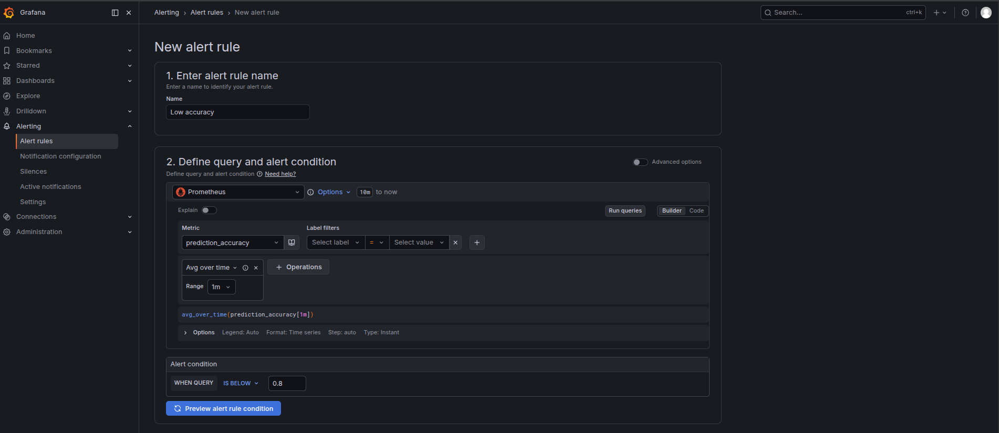
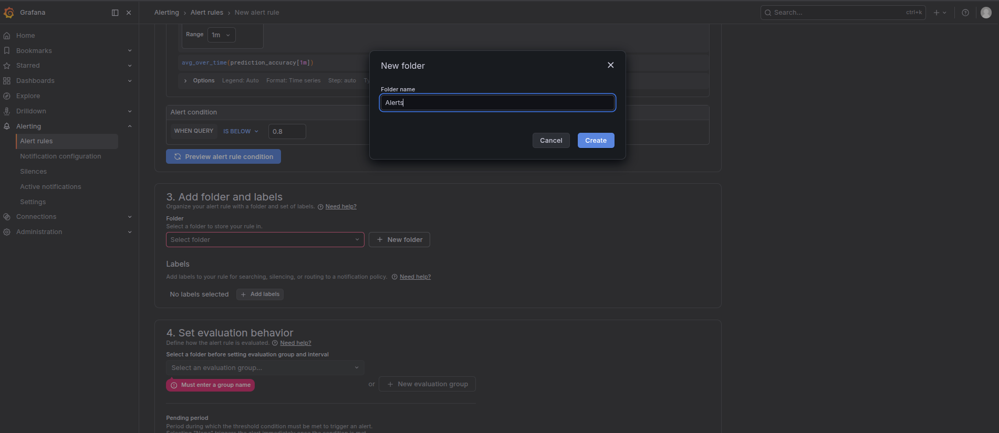
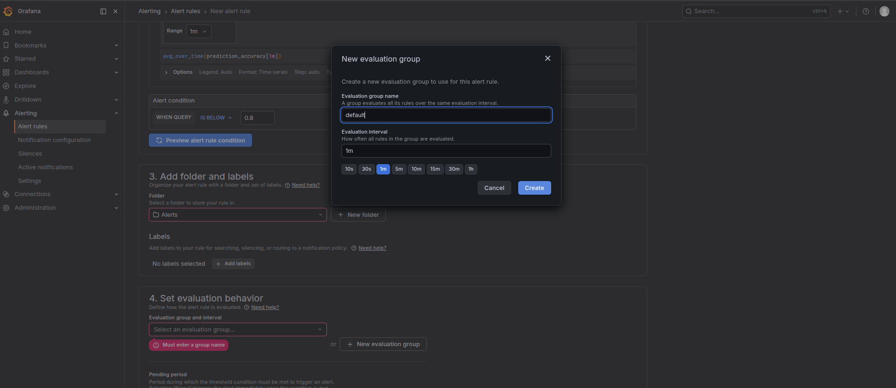
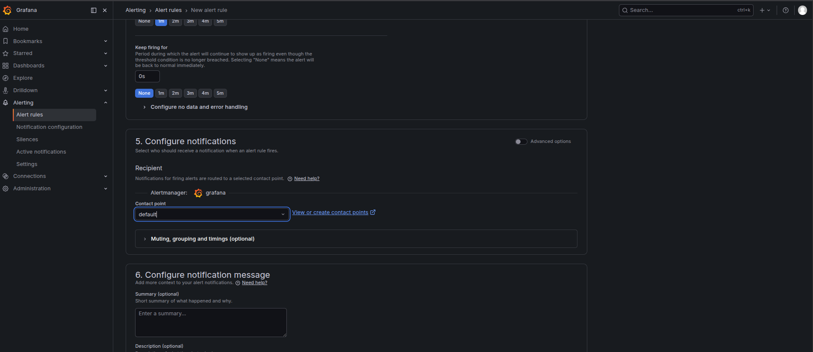

### Task

The xFusionCorp Industries ML platform team requires the enforcement of quality gates for the fraud-detection model in two key ways: first, by establishing an Evidently test suite that can be executed by any CI job against a production batch, and second, by integrating this suite with Grafana to ensure that on-call personnel are notified immediately if live accuracy declines. The monitoring stack is operational, and the test-suite scaffold is already established, including data loading, classification mapping, report execution, and publication to the **Evidently UI**.

Your task consists of two parts: (1) Complete the TODO block of the scaffold with the two specified threshold metrics, execute the test suite, and examine the results in the Evidently UI; (2) Create a Grafana alert rule that triggers when `avg_over_time(prediction_accuracy[1m])` falls below `0.80`.

1. **Evidently test suite**. `/root/code/monitoring/tests/test_suite.py` is pre-wired except for the gates themselves; a TODO block marks where two thresholded metrics must be appended to `METRICS`:
   - ja missing-values gate that fails the suite when the batch carries 10 or more missing values.
   - an accuracy gate that fails the suite when batch accuracy is 0.80 or lower.

   The batch it runs against is `/root/code/monitoring/tests/current.csv` (features + `is_fraud` target + the model's `prediction` column). The batch carries only a few missing values and its accuracy clears 0.80, so both gates should end up `SUCCESS`. A successful run writes `test_results.json` and publishes a snapshot to the Evidently workspace, viewable under the **Evidently UI** button (port `8000`) in the `fraud-detector quality gates` project (**Reports** tab).

2. **Grafana alert rule**. The Grafana UI is running on port `3000`. The Grafana button opens the login page. Admin credentials: `admin` / `grafana2026`. The **Prometheus** datasource is pre-provisioned. Metrics available:
   - `prediction_accuracy` – The gauge for this task. It drifts in a random walk around 0.85, so `avg_over_time(prediction_accuracy[1m])` is the smoothed signal the alert should watch.
   - `data_drift_score{column}`, `evidently_drift_share` – Per-feature PSI and the drifted-columns share, computed by the Evidently drift scorer at `/root/code/monitoring/drift/drift_scorer.py`.
   - `flask_http_request_total{version, endpoint, method}`, `model_inference_duration_seconds` – The other signals from the shared metric-emitter.

3. The alert rule must fire when `avg_over_time(prediction_accuracy[1m])` drops below `0.80`.

4. The end state must include:
   - `/root/code/monitoring/tests/test_results.json` exists and carries at least two Evidently test entries—a missing-values gate and an accuracy gate—all with status `SUCCESS`.
   - The Evidently UI's project carries at least one published run (snapshot).
   - `GET /api/v1/provisioning/alert-rules` returns a non-empty array.
   - At least one rule's PromQL expression references `prediction_accuracy`.
   - That rule's threshold evaluator carries `0.80` as a numeric parameter.

The same `0.80` accuracy gate is enforced at two altitudes: the Evidently test suite fails a CI pipeline before a degraded model ships, and the Grafana alert rule pages on-call after live accuracy slips. Evidently's `include_tests=True` turns each metric into a pass/fail assertion—the same structure a `pytest` run gives you, but over data and model quality—and the Evidently UI is where a reviewer reads those verdicts without touching code.

### Solution

- Update the `/root/code/monitoring/tests/test_suite.py`.

  ```python
  """Run the fraud-detector quality gates as an Evidently test suite.

  Startup has already seeded the latest production batch at
  ``tests/current.csv`` (features + the ``is_fraud`` target + the
  model's ``prediction`` column), created the Evidently workspace
  behind the **Evidently UI** button, and wired this script to publish
  every run there. The only missing piece is the two thresholded
  metrics that turn the report into a pass/fail gate -- add them in
  the TODO block below, then execute the file:

      python3 /root/code/monitoring/tests/test_suite.py
  """
  from __future__ import annotations

  import json

  import pandas as pd
  from evidently import Dataset, DataDefinition, Report
  from evidently.core.datasets import BinaryClassification
  from evidently.metrics import Accuracy, DatasetMissingValueCount
  from evidently.tests import gt, lt
  from evidently.ui.workspace import Workspace

  BATCH_CSV = "/root/code/monitoring/tests/current.csv"
  RESULTS_JSON = "/root/code/monitoring/tests/test_results.json"
  WORKSPACE_DIR = "/root/code/monitoring/workspace"
  PROJECT_NAME = "fraud-detector quality gates"

  # ----------------------------------------------------------------------
  # TODO 1: Gate data quality -- fail the suite when the batch carries
  #         10 or more missing values.
  #
  #         METRICS.append(DatasetMissingValueCount(tests=[lt(10)]))
  #
  # TODO 2: Gate model quality -- fail the suite when batch accuracy
  #         is 0.80 or lower. Use `Accuracy` with `tests=[gt(0.80)]`,
  #         appended the same way.
  # ----------------------------------------------------------------------
  METRICS = []

  # (append the two thresholded metrics here)
  METRICS.append(DatasetMissingValueCount(tests=[lt(10)]))
  METRICS.append(Accuracy(tests=[gt(0.80)]))


  def main() -> None:
      if not METRICS:
          print("METRICS is empty -- complete the TODO block first.")
          return

      df = pd.read_csv(BATCH_CSV)
      dd = DataDefinition(
          classification=[
              BinaryClassification(
                  target="is_fraud", prediction_labels="prediction"
              )
          ]
      )
      ds = Dataset.from_pandas(df, data_definition=dd)

      # include_tests=True turns every thresholded metric into a
      # pass/fail assertion -- Evidently's "test suite" mode.
      result = Report(metrics=METRICS, include_tests=True).run(current_data=ds)

      d = result.dict()
      with open(RESULTS_JSON, "w") as fh:
          json.dump(d, fh, indent=2, default=str)

      # Publish the run to the workspace behind the Evidently UI button.
      ws = Workspace.create(WORKSPACE_DIR)
      found = ws.search_project(PROJECT_NAME)
      project = found[0] if found else ws.create_project(PROJECT_NAME)
      ws.add_run(project.id, result)

      tests = d.get("tests", [])
      passed = sum(1 for t in tests if t.get("status") == "SUCCESS")
      print(f"Tests: {passed}/{len(tests)} passed -> {RESULTS_JSON}")
      for t in tests:
          status = str(t.get("status", "")).split(".")[-1]
          print(f"  - {t.get('name')}: {status}")
      print("Run published -- refresh the Evidently UI to inspect it.")


  if __name__ == "__main__":
      main()

  ```

- Run the script.

  ```bash
  python3 /root/code/monitoring/tests/test_suite.py
  ```

- Verify `/root/code/monitoring/tests/test_results.json` exists and carries at least two Evidently test entries—a missing-values gate and an accuracy gate—all with status `SUCCESS`.

- Log in to Grafana

- Create the alert

  ```
  Alerting -> Manage alert rules -> New alert rule
  ```

  

  <br />

  Create new folder

  

  <br />

  Create a new evaluation group

  

  <br />

  Select contact point

  

  <br />

- The following should return a no-empty json response

  ```bash
  curl -u admin:grafana2026 http://localhost:3000/api/v1/provisioning/alert-rules
  ```
