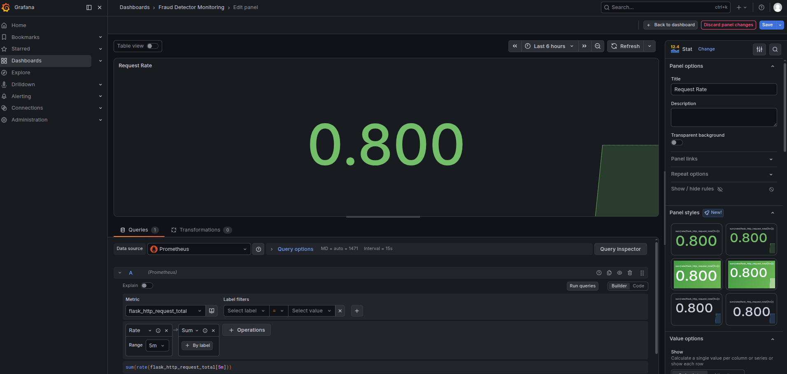
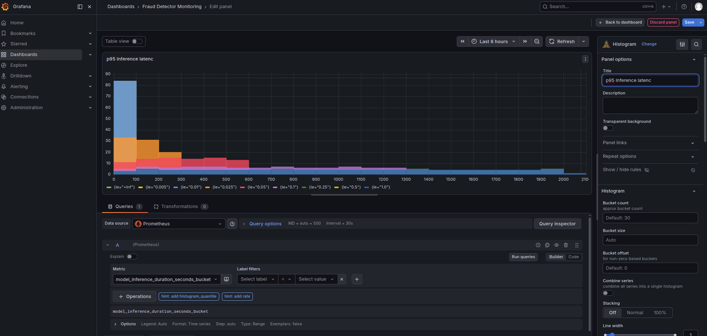
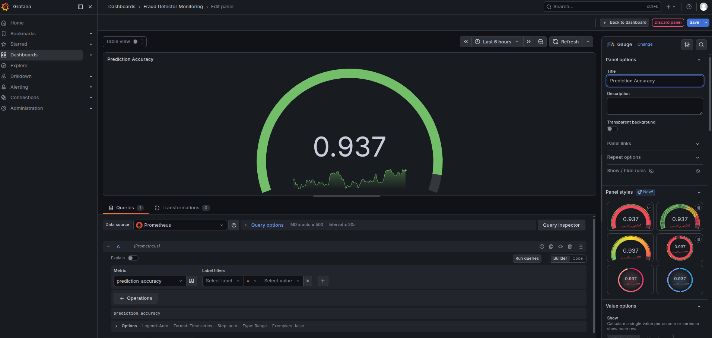
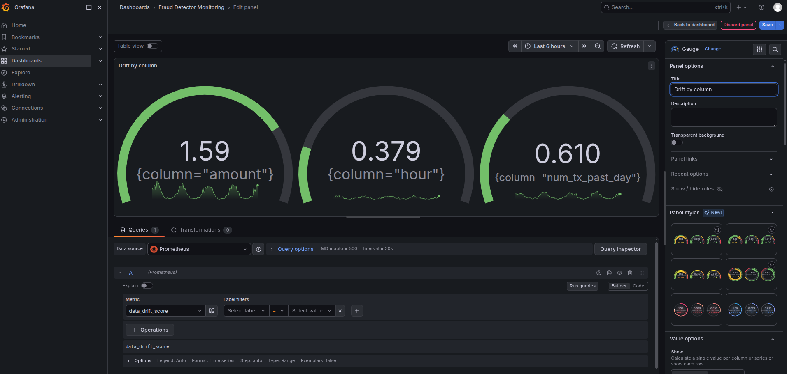
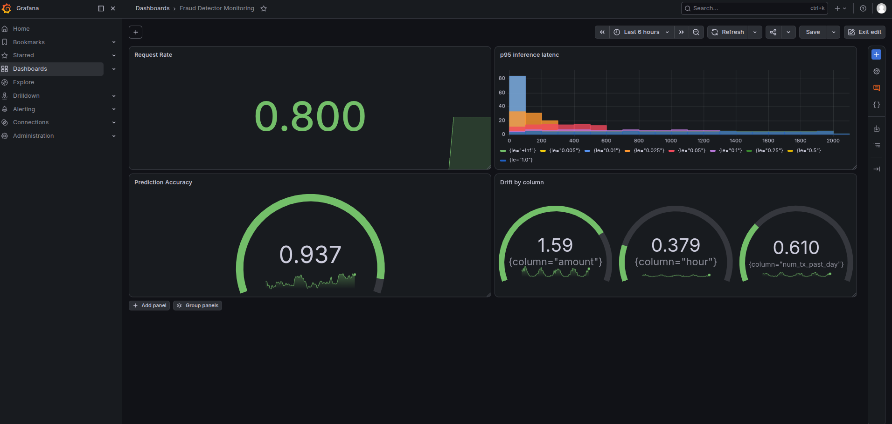

### Task

The xFusionCorp Industries ML platform team requires the creation of a **model-overview dashboard** in Grafana. This dashboard should display the following metrics side-by-side: request rate, p95 inference latency, current prediction accuracy, and Evidently-computed per-feature drift. This setup will facilitate a quick assessment of the model's health by the on-call engineer.

The existing monitoring stack includes the following components: an **Evidently drift scorer** that recalculates per-feature drift (PSI) against a reference window every 15 seconds; a Flask metric-emitter that republishes these scores alongside its serving signals; Prometheus, which is actively scraping data; and Grafana, which has the Prometheus datasource pre-provisioned.

Your task is to construct a **4-panel Grafana dashboard** that integrates multiple visualization types effectively.

1. The Grafana UI is running on port `3000`. The **Grafana** button opens the login page. Admin credentials: `admin` / `grafana2026`. The Prometheus datasource is pre-provisioned.

2. The dashboard must contain one panel for each of the four signals below, and mix at least three distinct visualization types across them:
   - **Request rate** – built from the `flask_http_request_total` counter (`labels version`, `endpoint`, `method`).
   - **p95 inference latency** – built from the `model_inference_duration_seconds` histogram (its `\_bucket` series carry the `le` label).
   - **Prediction accuracy** – the `prediction_accuracy` gauge.
   - **Drift by column** – the `data_drift_score` gauge, one series per `column` label. This is the Evidently signal: each value is the PSI the drift scorer computed for that feature in the latest window.

3. The same drift data is also visible from Evidently's side for cross-checking: the **Evidently UI** button (port `8000`) opens the `fraud-detector drift monitoring` project, whose **Dashboard** tab plots the drifted-columns share and per-column PSI over time (a new scoring run lands roughly every minute) and whose **Reports** tab lists the underlying runs. Nothing to configure there—it's the same drift data, seen from Evidently's side.

4. The end state must include:
   - `GET /api/search?type=dash-db` returns at least one user-created dashboard.
   - The dashboard carries 4 or more non-row panels.
   - The panel targets collectively reference `flask_http_request_total`, `model_inference_duration_seconds_bucket`, `prediction_accuracy`, and `data_drift_score`.
   - The panels use at least 3 distinct visualization types (e.g. `timeseries`, `stat`, `bargauge`).
   - The Evidently UI's project keeps accumulating scoring runs (pre-wired—nothing to change).

### Solution

- Log into Grafana.

- Create a new dashboard.

  ```
  Dashboards -> Create dashboard
  ```

- Add panel for **Request rate** and configure that.

  

  <br />

- Add panel for **p95 inference latency** and configure that.

  

  <br />

- Add panel for **Prediction accuracy** and configure that.

  

  <br />

- Add panel for **Drift by column** and configure that.

  

  <br />

- Save

  
