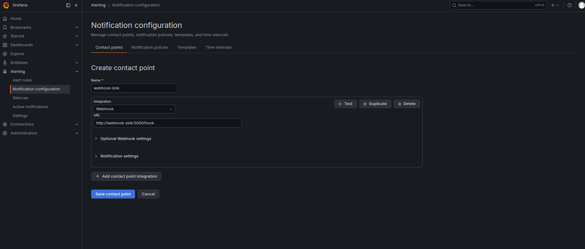
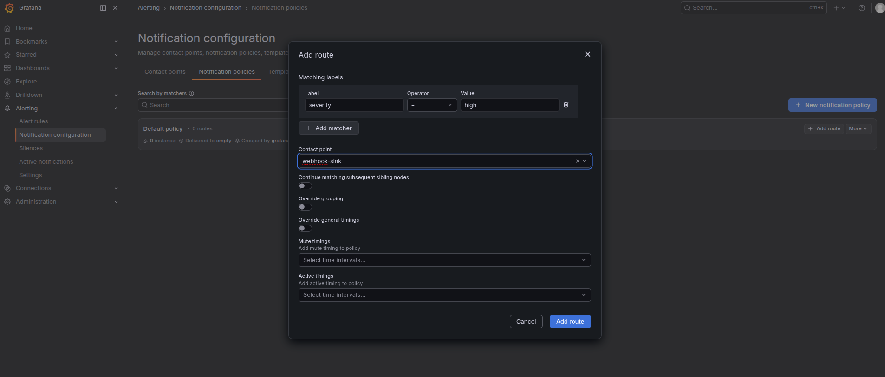

### Task

The xFusionCorp Industries ML platform team requires that high-severity model alerts trigger notifications to the on-call channel via webhook. Currently, the existing alert rules are effective only if an individual is paged when alerts are activated. The monitoring stack is operational, and an in-stack `webhook-sink` service (container `webhook-sink`) is available at `http://webhook-sink:5000/hook`. Additionally, Grafana has the Prometheus datasource already configured. Your objective is to set up Grafana alerting so that any alert with the label `severity=high` is directed to the specified webhook endpoint.

1. The Grafana UI is running on port `3000`. The **Grafana** button opens the login page. Admin credentials: `admin` / `grafana2026`. The webhook sink is reachable from Grafana at `http://webhook-sink:5000/hook`.

2. The end state must include:
   - `GET /api/v1/provisioning/contact-points` returns at least one contact point of type `webhook` whose `settings.url` references `webhook-sink`.
   - `GET /api/v1/provisioning/policies` returns a notification-policy tree containing a route whose `receiver` matches that contact point and whose matchers include `severity = high`.

Contact points answer the question 'where does a notification go?'—an endpoint (webhook, email, Slack). Notification policies answer 'which alerts go to which contact point?'—by label-matching the alert. Both pieces must be in place before any alert rule actually pages a human.

### Solution

- Log into Grafana.

- Create contact-point

  ```
  Alerting -> Notification configuration -> Contact points -> New contact point
  ```

  

  <br />

- Add a route to default notification policy

  ```
  Alerting -> Notification configuration -> Notification policies -> Default policy -> Add route
  ```

  

  <br />

- Verify

  The following should return a contact point of type `webhook` whose `settings.url` references `webhook-sink`

  ```bash
  curl -u admin:grafana2026 http://localhost:3000/api/v1/provisioning/contact-points
  ```

  The following should return a notification-policy tree containing a route whose `receiver` matches that contact point and whose matchers include `severity = high`.

  ```bash
  curl -u admin:grafana2026 http://localhost:3000/api/v1/provisioning/policies
  ```
