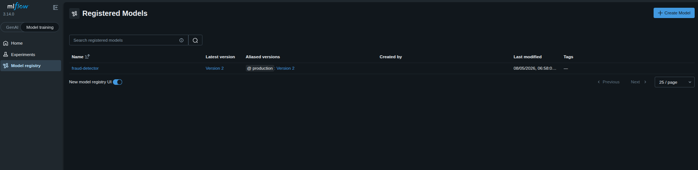

### Task

The xFusionCorp Industries ML platform team operates a drift-triggered retraining pipeline. When data drift exceeds the alert threshold, the pipeline automatically retrains the fraud-detection model and registers it as a new version of `fraud-detector`. Currently, there is an incumbent version `1` serving production traffic under the `production` alias, along with a newly retrained challenger version `2`, which has not yet been promoted. It is essential to avoid promoting the retrained model to production without evaluation, as this could result in a subpar model reaching users. Your task is to implement the promotion gate in `promote.py`, ensuring that the challenger is only promoted to `production` if it surpasses the incumbent's performance on the designated evaluation metric. After completing this task, proceed to execute the promotion.

1. The MLflow tracking server is on port `5000`; the **MLflow UI** button opens it. Under **Models → fraud-detector** you can see version `1` (alias `production`, `f1_score` `0.71`) and version `2` (no alias yet, `f1_score` `0.82`).

2. The project is at `/root/code/monitoring/`:
   - `retrain_pipeline.py` – the startup setup that registered v1 and v2. Correct; do not edit.
   - `promote.py` – the promotion-gate scaffold. Its `f1_of(version)` helper (reads a version's logged `f1_score`) is wired; the gate logic is a `# TODO` naming the MLflow client calls to use.

3. The gate must read the version the `production` alias currently points at (the champion) and its `f1_score`, read the challenger's `f1_score` (version 2), and re-point `production` at the challenger only if the challenger's is strictly greater—otherwise leave the alias unchanged.

4. The end state must include:
   - The `production` alias on `fraud-detector` resolves to version `2` (the challenger).
   - The version now serving `production` has a higher `f1_score` than the incumbent v1 — the gate promoted the better model, not a blind version bump.

MLflow 3.x replaced stage-based promotion (`Staging`/`Production`) with aliases — named pointers like `production` that decouple a label from a version, so downstream code loads `models:/fraud-detector@production` and promotion is just re-pointing the alias. A champion/challenger gate is the guardrail: never re-point `production` at a retrained model without first confirming it actually beats what is live.

### Solution

- Update `/root/code/monitoring/promote.py`

  ```python
  """Champion/challenger promotion gate.

  A drift-triggered retrain registered a new challenger version of
  `fraud-detector` (v2). The incumbent (v1) currently serves production
  traffic via the `production` alias. Promoting a retrained model blindly
  is how a worse model reaches production -- so gate the promotion on the
  candidate's evaluation metric.

  Run from /root/code/monitoring/:  python3 promote.py
  """
  from mlflow import MlflowClient

  TRACKING_URI = "http://localhost:5000"
  MODEL = "fraud-detector"
  PROD_ALIAS = "production"
  CHALLENGER_VERSION = "2"  # the version the drift-triggered retrain registered

  client = MlflowClient(tracking_uri=TRACKING_URI)


  def f1_of(version: str) -> float:
      """Read the f1_score metric logged on a model version's run."""
      mv = client.get_model_version(MODEL, version)
      return client.get_run(mv.run_id).data.metrics["f1_score"]


  def main() -> None:
      # TODO: implement the promotion gate.
      #   1. Find the version the `production` alias currently points at
      #      (client.get_model_version_by_alias(MODEL, PROD_ALIAS)) -- the
      #      champion -- and read its f1 with f1_of(...).
      #   2. Read the challenger's f1: f1_of(CHALLENGER_VERSION).
      #   3. Promote ONLY IF the challenger's f1 is strictly greater than the
      #      champion's: re-point the production alias at the challenger with
      #        client.set_registered_model_alias(MODEL, PROD_ALIAS, CHALLENGER_VERSION)
      #      and print that it was promoted. Otherwise, leave the alias
      #      untouched and print that the challenger was rejected.
      champion = client.get_model_version_by_alias(MODEL, PROD_ALIAS)
      champion_f1 = f1_of(champion.version)

      challenger_f1 = f1_of(CHALLENGER_VERSION)

      if challenger_f1 > champion_f1:
          client.set_registered_model_alias(
              MODEL,
              PROD_ALIAS,
              CHALLENGER_VERSION
          )


  if __name__ == "__main__":
      main()
  ```

- Run the script.

  ```bash
  python3 /root/code/monitoring/promote.py
  ```

- Verify that the version 2 has `production` alias

  ```
  MLflow UI -> Model training -> Model registry
  ```

  
