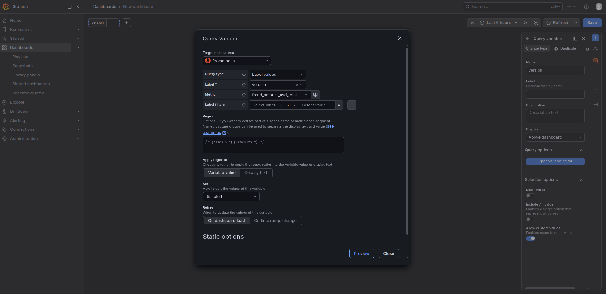
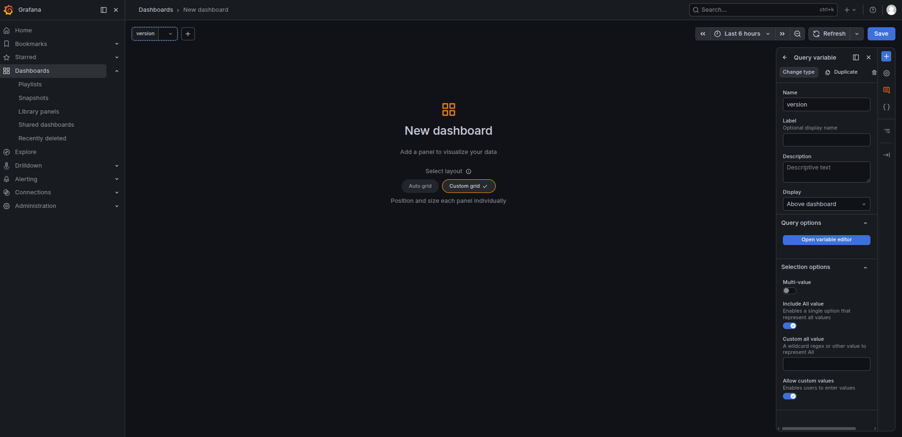
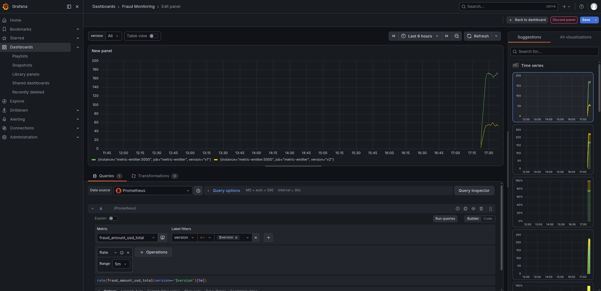
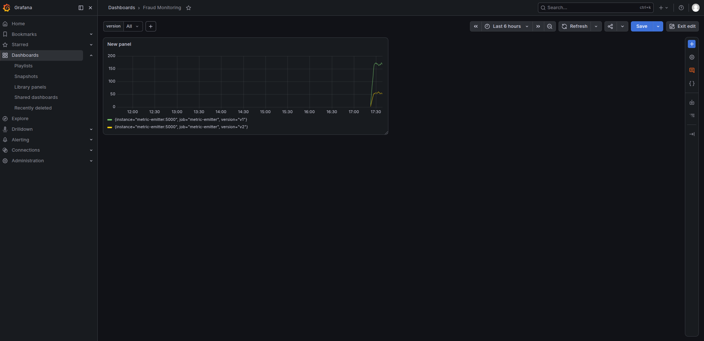

### Task

The xFusionCorp Industries ML platform team requires the ability to track total fraudulent transaction amounts in USD, in addition to standard model-serving signals. This data should be sliceable by model version on demand from a Grafana dashboard.

The monitoring stack is operational, and the Flask metric emitter is located at `/root/code/monitoring/app/metric_emitter.py`, which is bind-mounted into the container to allow for immediate recognition of edits after a restart. Grafana is already set up with a pre-provisioned Prometheus datasource.

**Metric emitter**. `/root/code/monitoring/app/metric_emitter.py` exposes the shared serving metrics. It needs a new `fraud_amount_usd_total` Counter carrying a `version` label, incremented inside the existing `_nudge_metrics` loop so each tick advances every version's total. After the emitter container is reloaded, Prometheus scrapes the new series.

**Grafana dashboard**. The Grafana UI is running on port `3000`. The Grafana button opens the login page. Admin credentials: `admin` / `grafana2026`. The dashboard needs a templating variable named `version` (query-sourced from the Prometheus datasource via `label_values(...))`, and a panel whose query references fraud_amount_usd_total and filters by `$version`.

The end state must include:

- Prometheus returns non-empty samples for `fraud_amount_usd_total`, with a `version` label on each series.
- One dashboard carries a templating variable named `version` whose query uses `label_values(...)`.
- The same dashboard has a panel whose query references `fraud_amount_usd_total` and uses `$version`.

Template variables decouple a dashboard's structure from the cardinality of its labels—a single panel renders per-version when the variable is `v1`, `v2`, or `All`. The counter -> labelled series -> `label_values` -> `$variable` flow is the backbone of any multi-tenant or multi-version ML dashboard.

### Solution

- Update `/root/code/monitoring/app/metric_emitter.py`

  ```python
  """Metric emitter for the Monitoring-section labs.

  Exposes a Prometheus `/metrics` endpoint carrying four simulated
  ML-serving signals:
    - `flask_http_request_total{version}`     — request counter, labelled by model version.
    - `prediction_accuracy`                   — gauge, random walk around 0.85.
    - `data_drift_score{column}`              — per-feature drift share.
    - `model_inference_duration_seconds`      — latency histogram.

  A background thread nudges the gauges and increments the counters
  every 5 seconds so Grafana panels built on top of these metrics
  see real motion rather than flat lines.
  """
  import random
  import threading
  import time

  from flask import Flask, jsonify
  from prometheus_client import CollectorRegistry, Counter, Gauge, Histogram, generate_latest
  from prometheus_client import CONTENT_TYPE_LATEST

  app = Flask(__name__)

  REGISTRY = CollectorRegistry()

  REQUEST_TOTAL = Counter(
      "flask_http_request_total",
      "Total HTTP requests handled, labelled by model version.",
      labelnames=["version", "endpoint", "method"],
      registry=REGISTRY,
  )

  PREDICTION_ACCURACY = Gauge(
      "prediction_accuracy",
      "Rolling prediction accuracy on the shadow eval set.",
      registry=REGISTRY,
  )

  DATA_DRIFT_SCORE = Gauge(
      "data_drift_score",
      "Population Stability Index (PSI) per feature column.",
      labelnames=["column"],
      registry=REGISTRY,
  )

  INFERENCE_LATENCY = Histogram(
      "model_inference_duration_seconds",
      "End-to-end inference duration in seconds.",
      buckets=(0.005, 0.01, 0.025, 0.05, 0.1, 0.25, 0.5, 1.0),
      registry=REGISTRY,
  )

  FRAUD_AMOUNT_USD_TOTAL = Counter(
      "fraud_amount_usd_total",
      "Total fradulent transaction amount in USD",
      labelnames=["version"],
      registry=REGISTRY
  )

  def _nudge_metrics() -> None:
      random.seed(42)
      accuracy = 0.85
      drift = {"amount": 0.10, "hour": 0.12, "num_tx_past_day": 0.08}
      while True:
          # Simulate a handful of requests across two model versions.
          for version in ("v1", "v1", "v1", "v2"):
              REQUEST_TOTAL.labels(version=version, endpoint="/predict", method="POST").inc()
              INFERENCE_LATENCY.observe(random.uniform(0.005, 0.15))
              FRAUD_AMOUNT_USD_TOTAL.labels(version=version).inc(
                  random.uniform(50, 500)
              )

          # Random-walk the accuracy around 0.85, clipped to [0.70, 0.95].
          accuracy = max(0.70, min(0.95, accuracy + random.uniform(-0.02, 0.02)))
          PREDICTION_ACCURACY.set(accuracy)

          # Random-walk each column's drift score.
          for column, base in drift.items():
              drift[column] = max(0.01, min(0.60, drift[column] + random.uniform(-0.02, 0.03)))
              DATA_DRIFT_SCORE.labels(column=column).set(drift[column])

          time.sleep(5)


  @app.route("/health")
  def health():
      return jsonify({"status": "ok"}), 200


  @app.route("/metrics")
  def metrics():
      return generate_latest(REGISTRY), 200, {"Content-Type": CONTENT_TYPE_LATEST}


  if __name__ == "__main__":
      threading.Thread(target=_nudge_metrics, daemon=True).start()
      app.run(host="0.0.0.0", port=5000)
  ```

- Restart the metric emitter container

  ```bash
  # Get the metric emitter container id
  docker ps

  docker restart <metric emitter id>
  ```

- Verify prometheus returns `fraud_amount_usd_total`

  ```bash
  curl http://localhost:9090/api/v1/query?query=fraud_amount_usd_total
  ```

- Create new variable and save the dashboard

  ```
  Grafana -> Dashboards -> Create dashboard -> Dashboard controls -> Variable -> Query
  ```

  

  <br />

  Enable all options

  

  <br />

- Add panel and configure that

  

  <br />

  
