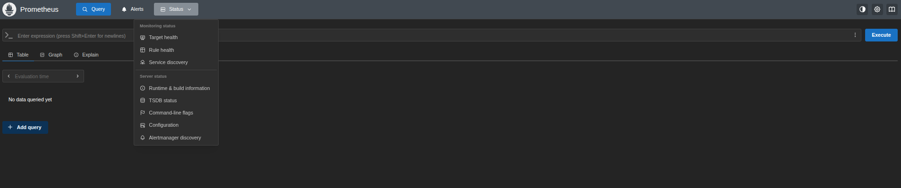
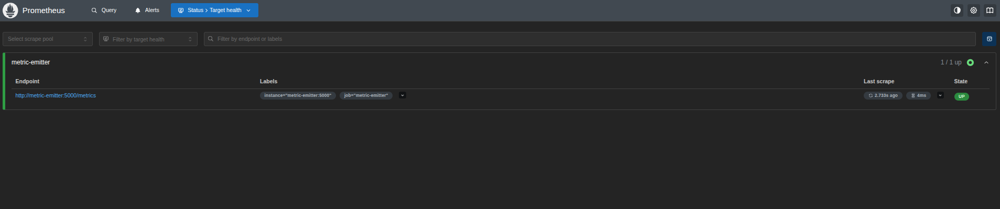
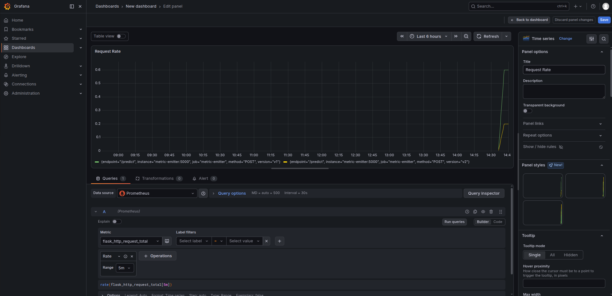
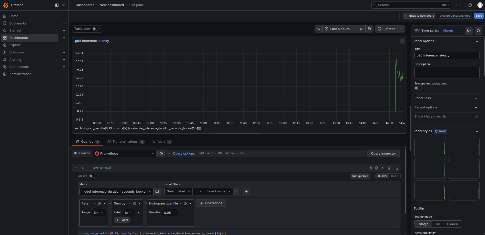
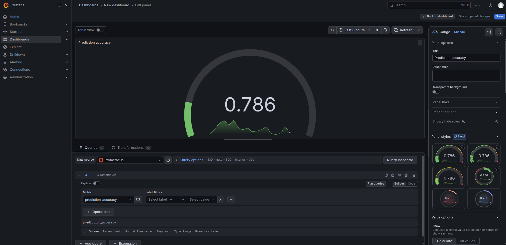
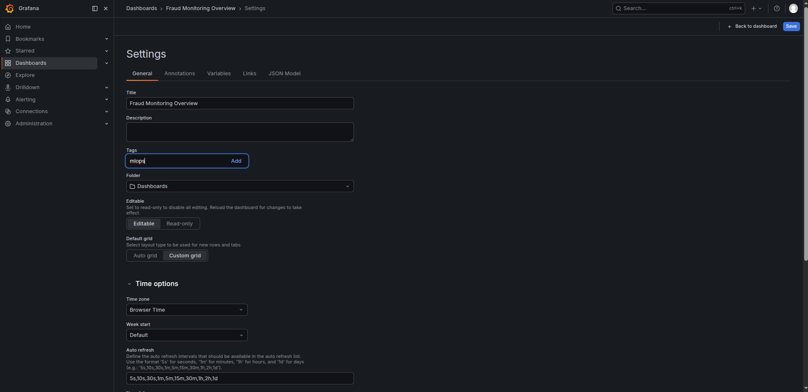
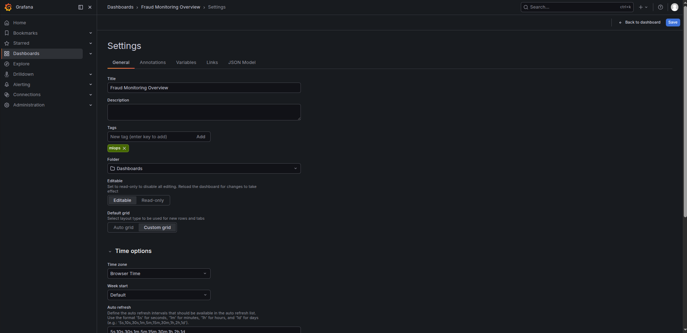
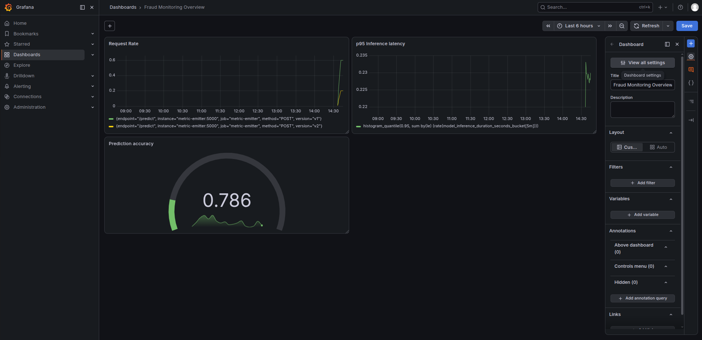

### Task

The xFusionCorp Industries ML platform team attempted to implement a complete end-to-end monitoring stack for the fraud-detection model. This stack includes an Evidently drift scorer connected to a Flask metric-emitter, which is then scraped by Prometheus and visualized using Grafana. However, the monitoring flow is currently non-functional. Grafana displays empty panels, Prometheus indicates that the `metric-emitter` is DOWN on the `Targets` page, and attempts to access the emitter's `/metrics` endpoint result in a 404 error. The Evidently scorer itself is operational, as evidenced by the presence of drift scores in the hand-off file; however, all downstream components are failing, preventing any signals from reaching the dashboard. Within the stack's configuration, there are three wiring issues that need to be addressed. Your primary objective is to identify and resolve all three issues, and subsequently, to construct a tagged **monitoring overview** dashboard in Grafana.

1. The stack is at `/root/code/monitoring/` with three services defined in `docker-compose.yml`, plus the host-side Evidently scorer:
   - `metric-emitter` – Flask exporter (Python source bind-mounted). Republishes the Evidently drift scores as `data_drift_score{column}` / `evidently_drift_share` next to its own serving signals.
   - `mon-prometheus` – Port `9090`.
   - `mon-grafana` – Port `3000`, `admin` / `grafana2026`. The Prometheus datasource is provisioned on boot.
   - Evidently drift scorer – host process (`drift/drift_scorer.py`), rescores per-feature PSI every 15 s into `drift/drift_scores.json` and publishes a run to the **Evidently UI** (port `8000`) every ~minute. **Healthy**—**not part of the bug hunt**. The Evidently UI button -> `fraud-detector drift monitoring` -> **Dashboard** tab confirms drift data is flowing at the source; everything downstream of it is what's broken.

2. **Three integration bugs** must be diagnosed and fixed — each lives in exactly one configuration file under `/root/code/monitoring/`. The symptoms:
   - `metric-emitter`'s `/metrics` endpoint returns `404`.
   - Prometheus's **Targets** page lists `metric-emitter` as `DOWN`.
   - Grafana renders empty panels even when Prometheus has fresh samples.

   Start from the emitter itself — `curl -i http://localhost:5000/metrics` shows the 404, and `docker compose ps` from `/root/code/monitoring/` shows what is running. The affected services must be reloaded for the fixed configs to take effect.

3. A **tagged monitoring-overview dashboard** must also be built in Grafana (port `3000`, the **Grafana** button, `admin` / `grafana2026`): three panels covering request rate, p95 inference latency, and prediction accuracy (or similar signals from the shared metric-emitter, e.g. the Evidently-computed `data_drift_score`), saved with a title and at least one tag (e.g. `mlops` or `monitoring`) so the ops team can find it from the Dashboards search.

4. The end state must include:
   - `curl -sf http://localhost:5000/metrics` returns HTTP 200.
   - Prometheus `GET /api/v1/targets` lists the `metric-emitter` job with `health: "up"`.
   - Grafana `GET /api/datasources` shows the Prometheus datasource URL ending in `:9090`.
   - One user-created dashboard has 3 or more panels and at least one tag.
   - The Evidently UI's project keeps accumulating scoring runs (pre-wired—nothing to change).

A monitoring stack is only as useful as its weakest link. Evidently can score drift perfectly and still page nobody: each of these three bugs is silent on its own—none of them crashes a container—but together they cost you every metric Grafana would otherwise surface. The capstone is reading failure symptoms back to their config file, not retyping Python.

### Solution

- Change directory

  ```bash
  cd monitoring/
  ```

- Update `./app/metric-emitter.py`

  Change the metrics endpoint from `prom-metrics` to `metrics`

  ```python
  """Metric emitter for the Monitoring-section labs.

  Exposes a Prometheus metrics endpoint carrying the ML-serving signals:
    - `flask_http_request_total{version}`     - request counter, labelled by model version.
    - `prediction_accuracy`                   - gauge, random walk around 0.85.
    - `data_drift_score{column}`              - per-feature PSI, computed by the
                                                Evidently drift scorer
                                                (`../drift/drift_scorer.py`) and
                                                read from the bind-mounted
                                                scores file.
    - `evidently_drift_share`                 - share of feature columns Evidently
                                                flags as drifted in the latest window.
    - `model_inference_duration_seconds`      - latency histogram.

  A background thread refreshes the gauges and increments the counters
  every 5 seconds so Grafana panels built on top of these metrics see
  real motion rather than flat lines. Until the Evidently scorer has
  produced its first scores file, the drift gauges fall back to a
  deterministic random walk so panels never flatline.
  """
  import json
  import os
  import random
  import threading
  import time

  from flask import Flask, jsonify
  from prometheus_client import CollectorRegistry, Counter, Gauge, Histogram, generate_latest
  from prometheus_client import CONTENT_TYPE_LATEST

  app = Flask(__name__)

  REGISTRY = CollectorRegistry()

  DRIFT_SCORES_PATH = os.environ.get("DRIFT_SCORES_PATH", "/drift/drift_scores.json")

  REQUEST_TOTAL = Counter(
      "flask_http_request_total",
      "Total HTTP requests handled, labelled by model version.",
      labelnames=["version", "endpoint", "method"],
      registry=REGISTRY,
  )

  PREDICTION_ACCURACY = Gauge(
      "prediction_accuracy",
      "Rolling prediction accuracy on the shadow eval set.",
      registry=REGISTRY,
  )

  DATA_DRIFT_SCORE = Gauge(
      "data_drift_score",
      "Population Stability Index (PSI) per feature column, "
      "scored by the Evidently drift scorer.",
      labelnames=["column"],
      registry=REGISTRY,
  )

  EVIDENTLY_DRIFT_SHARE = Gauge(
      "evidently_drift_share",
      "Share of feature columns Evidently flags as drifted "
      "in the latest scoring window.",
      registry=REGISTRY,
  )

  INFERENCE_LATENCY = Histogram(
      "model_inference_duration_seconds",
      "End-to-end inference duration in seconds.",
      buckets=(0.005, 0.01, 0.025, 0.05, 0.1, 0.25, 0.5, 1.0),
      registry=REGISTRY,
  )


  def _read_evidently_scores():
      """Latest per-column scores from the Evidently drift scorer.

      Returns ({column: psi}, drift_share), or None while the scorer has
      not produced a readable scores file yet.
      """
      try:
          with open(DRIFT_SCORES_PATH) as fh:
              payload = json.load(fh)
          scores = {
              str(column): float(value)
              for column, value in (payload.get("drift_scores") or {}).items()
          }
          if not scores:
              return None
          return scores, float(payload.get("drift_share", 0.0))
      except (OSError, ValueError):
          return None


  def _nudge_metrics() -> None:
      random.seed(42)
      accuracy = 0.85
      fallback_drift = {"amount": 0.10, "hour": 0.12, "num_tx_past_day": 0.08}
      while True:
          # Simulate a handful of requests across two model versions.
          for version in ("v1", "v1", "v1", "v2"):
              REQUEST_TOTAL.labels(version=version, endpoint="/predict", method="POST").inc()
              INFERENCE_LATENCY.observe(random.uniform(0.005, 0.15))

          # Random-walk the accuracy around 0.85, clipped to [0.70, 0.95].
          accuracy = max(0.70, min(0.95, accuracy + random.uniform(-0.02, 0.02)))
          PREDICTION_ACCURACY.set(accuracy)

          # Republish the Evidently-computed drift scores; fall back to a
          # random walk only while the scorer's first file is pending.
          evidently = _read_evidently_scores()
          if evidently is not None:
              scores, drift_share = evidently
              for column, score in scores.items():
                  DATA_DRIFT_SCORE.labels(column=column).set(score)
              EVIDENTLY_DRIFT_SHARE.set(drift_share)
          else:
              for column in fallback_drift:
                  fallback_drift[column] = max(
                      0.01,
                      min(0.60, fallback_drift[column] + random.uniform(-0.02, 0.03)),
                  )
                  DATA_DRIFT_SCORE.labels(column=column).set(fallback_drift[column])

          time.sleep(5)


  @app.route("/health")
  def health():
      return jsonify({"status": "ok"}), 200


  @app.route("/metrics")
  def metrics():
      return generate_latest(REGISTRY), 200, {"Content-Type": CONTENT_TYPE_LATEST}


  if __name__ == "__main__":
      threading.Thread(target=_nudge_metrics, daemon=True).start()
      app.run(host="0.0.0.0", port=5000)

  ```

- Build and run the images

  ```bash
  docker compose down
  docker compose up --build -d
  ```

- Verify the `metrics` endpoint work

  ```bash
  curl -i http://localhost:5000/metrics
  ```

- Update the `./prometheus.yml`

  Fix the target port

  ```yml
  global:
    scrape_interval: 5s
    evaluation_interval: 5s

  scrape_configs:
    - job_name: metric-emitter
      static_configs:
        - targets:
            - metric-emitter:5000
  ```

- Restart the container

  ```bash
  docker compose restart prometheus
  ```

- Verify the target health is `up`

  ```
  Prometheus -> Status -> Target health
  ```

  

  <br />

  

  <br />

  Can verify using `curl localhost:9090/api/v1/targets` as well

- Fix the port in `grafana/provisioning/datasources/prometheus.yml`

  ```yml
  apiVersion: 1

  datasources:
    - name: Prometheus
      type: prometheus
      access: proxy
      url: http://prometheus:9090
      isDefault: true
      editable: true
  ```

- Restart the container

  ```bash
  docker compose restart grafana
  ```

- Verify the grafana datasource url is ending with `9090`

  ```bash
  curl -u admin:grafana2026 http://localhost:3000/api/datasources
  ```

- Log into grafana and create the dashboard

  ```
  Grafana -> Dashboards -> Create dashboard
  ```

  Add panel for visualizing request rate

  

  <br />

  Add panel for visualizing p95 inference latency

  

  <br />

  Add panel for visualizing prediction accuracy

  

  <br />

- Save the dashboard with a tag

  ```
  Dashboard - Settings -> View all settings
  ```

  

  <br />

  

  <br />

  
