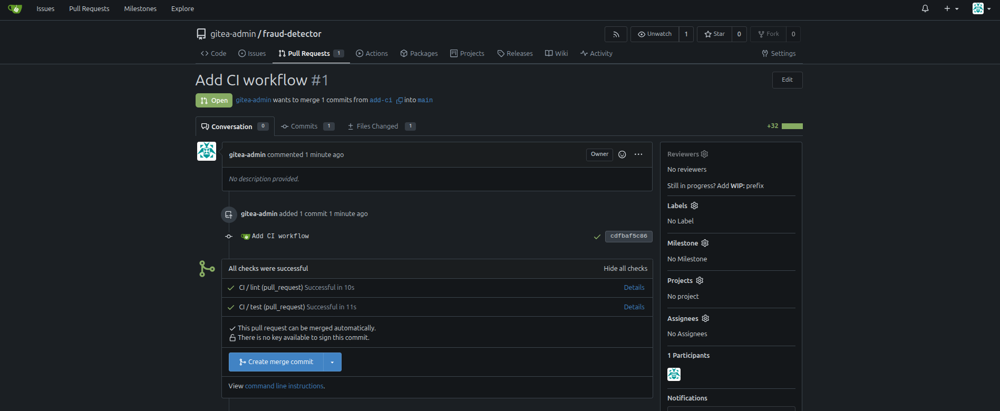

### Task

The xFusionCorp Industries ML platform team requires that pull requests for the `fraud-detector` repository automatically run linting and testing processes prior to the review stage. A local Gitea server is currently operational with the `fraud-detector` repository pre-pushed on the `main` branch. Additionally, a self-hosted Actions runner has been registered and is awaiting jobs. Your objective is to complete the integration of the CI workflow template, which is located at `.gitea/workflows/ci.yml.template` on the main branch, within a feature branch. Once completed, open a pull request, monitor the Checks tab for successful approvals, and subsequently merge the pull request into the `main` branch.

1. The Gitea UI is running on port `3000` (the **Gitea** button opens the login page). Admin credentials: `gitea-admin` / `gitea2026`. The repo is at `http://localhost:3000/gitea-admin/fraud-detector`, with a working clone at `/root/code/fraud-detector` (on `main`).

2. The scaffold under `/root/code/fraud-detector/` lints clean and has passing tests: `src/train.py` (a deterministic synthetic training script), `tests/test_train.py` (three passing unit tests), `pyproject.toml` (Ruff + pytest config), and `.gitea/workflows/ci.yml.template` — a pre-written CI workflow with the `on:` triggers and `lint` + `test` job skeletons already wired, plus `# TODO:` markers on the two `run:` lines that need filling in. Ruff and pytest are both installed on the host. Gitea Actions only schedules `*.yml` / `*.yaml` files, so the `.template` suffix keeps the file inert until it is renamed to `ci.yml`.

3. The end state must include:
   - A workflow file `.gitea/workflows/ci.yml` on branch `add-ci` that parses as YAML and declares both a `lint` and a `test` job.
   - One pull request in the repo targeting `main`, with `add-ci` as its head branch.
   - That PR's head commit reports combined status `success` on GET `/api/v1/repos/gitea-admin/fraud-detector/commits/{sha}/status`.
   - The PR is merged into `main` (`merged: true` on the pulls API).

Gitea Actions uses the same YAML syntax as GitHub Actions, so the workflow you ship here is also the kind of file you would drop into any `github.com` repo. Real CI engineers rarely author these from scratch — they inherit a template and edit the two or three lines that are project-specific, which is exactly what the `.template` scaffold mirrors.

### Solution

- Change directory

  ```bash
  cd fraud-detector/
  ```

- Create new branch

  ```bash
  git checkout -b add-ci
  ```

- Rename the file

  ```bash
  mv .gitea/workflows/ci.yml.template .gitea/workflows/ci.yml
  ```

- Update the `ci.yml`

  ```yml
  # Gitea Actions CI workflow for the fraud-detector repo.
  #
  # Rename this file to `ci.yml`, fill in the two TODO `run:` lines,
  # and commit + push on your feature branch. Gitea Actions only
  # schedules workflow files named `.yml` or `.yaml`, so the
  # `.template` suffix keeps this scaffold inert until it's renamed.
  name: CI

  on:
    pull_request:
      branches: [main]
    push:
      branches: [main]

  jobs:
    lint:
      runs-on: ubuntu-latest
      steps:
        - uses: actions/checkout@v4
        - name: Install ruff
          run: pip install --break-system-packages ruff
        - name: Run ruff
          run: ruff check src tests

    test:
      runs-on: ubuntu-latest
      steps:
        - uses: actions/checkout@v4
        - name: Install pytest
          run: pip install --break-system-packages pytest
        - name: Run pytest
          run: pytest tests/ -v
  ```

- Commit and push the changes

  ```bash
  git add .
  git commit -m "Add CI workflow"
  git push -u origin add-ci
  ```

- Log into Gitea

- Create the pull request and wait for the checks to run

  

  <br />

- Merge the pull request

- Verify that the statuses are `success`

  ```bash
  curl -u gitea-admin:gitea2026 http://localhost:3000/api/v1/repos/gitea-admin/fraud-detector/commits/{sha}/status
  ```
