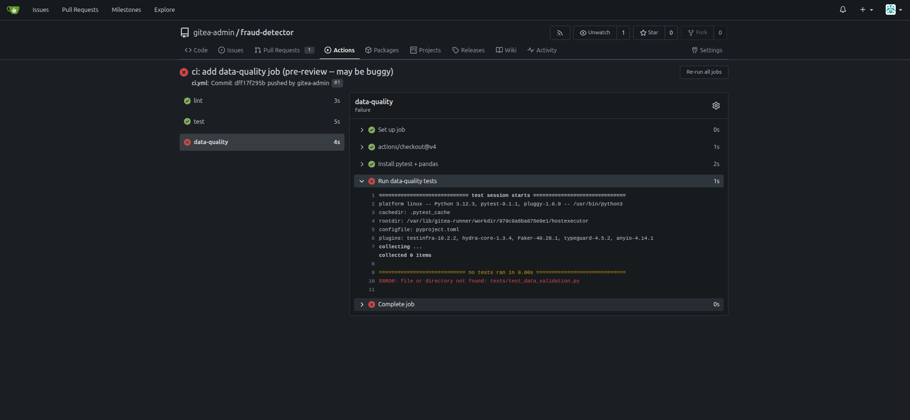
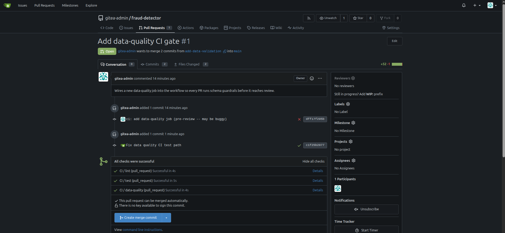

### Task

The xFusionCorp Industries ML platform team requires data-schema tests to be executed as a continuous integration (CI) gate for every pull request, ensuring that poor training data is detected before it affects the model. A team member has submitted a pull request titled **Add data-quality CI gate** in the `fraud-detector` repository; however, the newly added `data-quality` job has failed on its initial execution. Your objective is to examine the failed run log in Gitea Actions, determine the cause of the job failure, rectify the workflow, and push your changes so that the pull request is successful.

1. The Gitea UI is running on port `3000` (the **Gitea** button opens the login page). Admin credentials: `gitea-admin` / `gitea2026`. The repo lives at `http://localhost:3000/gitea-admin/fraud-detector` and a working clone is at `/root/code/fraud-detector`, already checked out on branch `add-data-validation`.

2. The pre-opened PR's workflow at `.gitea/workflows/ci.yml` declares three jobs: **lint**, **test** (both green), and **data-quality** (meant to run the data-schema tests, currently `red`). Open the failed data-quality run from the PR's Checks tab to read its log.

3. The end state must include:
   - The `data-quality` job is still declared in the workflow (do not delete the job itself).
   - The `data-quality` job's pytest step references a `.py` file that exists on the `add-data-validation` branch.
   - After the latest push, the PR's head commit's combined status reaches `success` (all three jobs green).

The point of a red CI run is not just the red pill in the PR—it is the log underneath it. A workflow can look fine by static inspection and still fail at runtime.

### Solution

- Log into gitea, look at the logs and find the issue

  

- Change directory

  ```bash
  cd fraud-detector/
  ```

- Update the `.gitea/workflows/ci.yml`

  Correct the file name under `data-quality` from `tests/test_data_validation.py` to `tests/test_data_quality.py`

  ```yml
  name: CI

  on:
    pull_request:
      branches: [main]
    push:
      branches: [main]

  jobs:
    lint:
      runs-on: ubuntu-latest
      steps:
        - uses: actions/checkout@v4
        - name: Install ruff
          run: pip install --break-system-packages ruff
        - name: Run ruff
          run: ruff check src tests

    test:
      runs-on: ubuntu-latest
      steps:
        - uses: actions/checkout@v4
        - name: Install pytest
          run: pip install --break-system-packages pytest
        - name: Run pytest
          run: python3 -m pytest tests/test_train.py -v

    data-quality:
      runs-on: ubuntu-latest
      steps:
        - uses: actions/checkout@v4
        - name: Install pytest + pandas
          run: pip install --break-system-packages pytest pandas
        - name: Run data-quality tests
          run: python3 -m pytest tests/test_data_quality.py -v
  ```

- Commit and push the changes

  ```bash
  git add .gitea/workflows/ci.yml
  git commit -m "Fix data quality CI test path"
  git push
  ```

- Verify that the PR's head commit's combined status reaches `success`.

  
