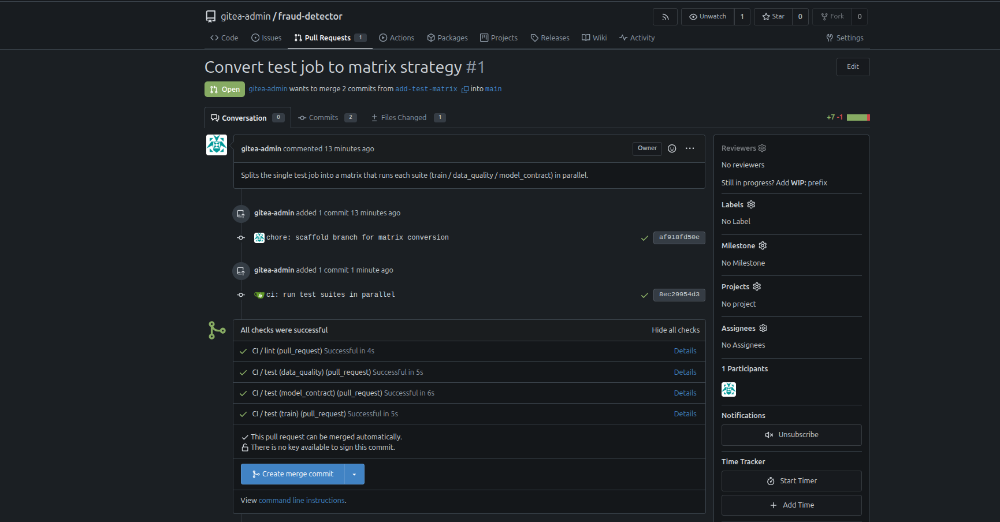

### Task

The xFusionCorp Industries ML platform team has three distinct test suites within the `fraud-detector` repository: unit tests (`test_train.py`), data quality tests (`test_data_quality.py`), and model contract tests (`test_model_contract.py`). Currently, the continuous integration (CI) pipeline executes all three suites serially within a single `test` job. As the test suites expand, this configuration is becoming a significant bottleneck for every pull request (PR). A teammate has submitted a PR titled **Convert test job to matrix strategy**. Your task is to modify the workflow to enable the `test` job to utilize a Gitea Actions matrix, allowing each test suite to run in its own parallel job.

1. The Gitea UI is running on port `3000` (the **Gitea** button opens the login page). Admin credentials: `gitea-admin` / `gitea2026`. The repo lives at `http://localhost:3000/gitea-admin/fraud-detector` and a working clone is at `/root/code/fraud-detector`, already checked out on branch `add-test-matrix`. The PR is pre-opened.

2. The current `.gitea/workflows/ci.yml` declares a `test` job that runs all suites serially on a single runner, alongside a `lint` job. Three test files live under `tests/`: `test_train.py`, `test_data_quality.py`, `test_model_contract.py`. The goal is to fan the `test` job out over a `strategy.matrix` so each suite runs in its own parallel cell, while the `lint` job stays unchanged.

3. The end state must include:
   - The `test` job in the workflow declares `strategy.matrix` whose list dimension contains `train`, `data_quality`, and `model_contract`.
   - Every matrix value maps to an existing `tests/test_<value>.py` file on the `add-test-matrix` branch.
   - The latest run on the PR head commit reports combined status `success`, with at least three `test` status entries (one per matrix cell).

A matrix strategy is the CI equivalent of a loop variable: one job definition, many parameterised executions. The classical case is a Python-version matrix (3.10 / 3.11 / 3.12), but any axis works—test suites, feature flags, target platforms. The point is to express 'run this N times with N variants' once instead of copying the job body.

### Solution

- Change directory

  ```bash
  cd fraud-detector/
  ```

- Update the `.gitea/workflows/ci.yml`

  ```yml
  name: CI

  on:
    pull_request:
      branches: [main]
    push:
      branches: [main]

  jobs:
    lint:
      runs-on: ubuntu-latest
      steps:
        - uses: actions/checkout@v4
        - name: Install ruff
          run: pip install --break-system-packages ruff
        - name: Run ruff
          run: ruff check src tests

    test:
      runs-on: ubuntu-latest
      steps:
        - uses: actions/checkout@v4
        - name: Install pytest + runtime deps
          run: pip install --break-system-packages pytest pandas numpy scikit-learn joblib
        - name: Run all tests
          run: python3 -m pytest tests/test_${{ matrix.list }}.py -v
  ```

- Commit and push the changes

  ```bash
  git add .gitea/workflows/ci.yml
  git commit -m "ci: run test suites in parallel"
  git push
  ```

- Verify using the Gitea UI at PR head commit report

  
