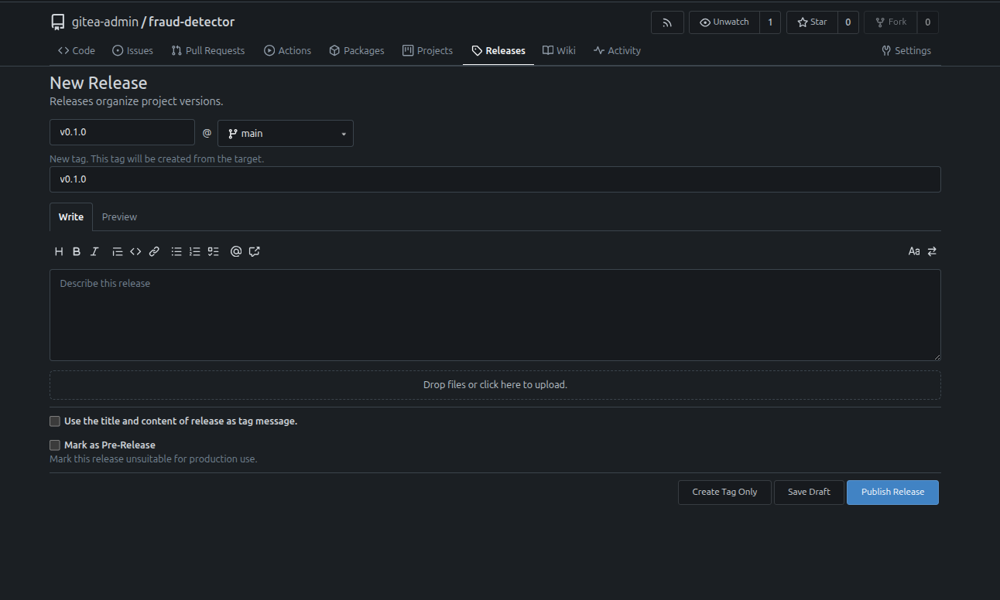

### Task

The xFusionCorp Industries machine learning platform team requires that every `fraud-detector` release tag is reproducible from a single Gitea page. This includes the Docker image used in production, the `metrics.json` file that details the model's performance, and a permanent link to the commit that generated these artifacts. A tag-triggered release workflow has been established in the `main` branch at `.gitea/workflows/release.yml`. However, the two container-registry steps, labeled **Build image** and **Push image to Gitea registry**, remain incomplete and currently only contain TODO stubs that result in an `exit 1`, preventing any image from being shipped with a release. Your task is to implement the necessary functionality for these two steps, ensuring that the workflow successfully builds the Docker image and publishes it to Gitea's integrated container (package) registry. Following the completion of these steps, proceed to create the **v0.1.0** release, allowing the tag to trigger the finalized workflow.

1. The Gitea UI is running on port `3000` (the **Gitea** button opens the login page). Admin credentials: `gitea-admin` / `gitea2026`. The repo is at `http://localhost:3000/gitea-admin/fraud-detector` and a working clone is at `/root/code/fraud-detector` (on main).

2. The release workflow (`.gitea/workflows/release.yml`) triggers on any `v\*` tag push. Its `build-and-publish` job already logs in to `localhost:3000` (Gitea's built-in container registry) using the pre-provisioned repository secret `REGISTRY_TOKEN`, resolves the image version from the git tag (`steps.version.outputs.VERSION`), and runs `python3 -m src.train` to emit `artifacts/metrics.json` and attach it to the release via `akkuman/gitea-release-action@v1`. The two steps in between — **Build image and Push image to Gitea registry** — are TODO stubs that currently `exit 1`. The surrounding steps set `$REGISTRY`, `$IMAGE`, and the resolved version (`steps.version.outputs.VERSION`) for the two steps to use.

3. Once the workflow is completed on `main`, publishing a `v0.1.0` release (target `main`, any non-empty title) from the repo's **Releases** tab cuts the tag that triggers the run, which publishes the image and attaches the metrics file.

4. The end state must include:
   - `GET /api/v1/repos/gitea-admin/fraud-detector/releases/tags/v0.1.0` returns a release whose `tag_name` is `v0.1.0`.
   - `release.yml` at the `v0.1.0` tag runs `docker build` and `docker push` in the `build-and-publish` job (the image is published by CI, not by hand).
   - The tag's commit SHA reports combined status `success` on its checks.
   - The release's `assets` array contains an entry whose name resolves to `metrics.json`.
   - Gitea's packages API (`GET /api/v1/packages/gitea-admin?type=container`) lists a container package named `fraud-detector` with a version equal to `v0.1.0` (or `0.1.0`).

Tagging a release is the moment a commit becomes addressable by humans, not just by SHA. The workflow's job is to make sure the release carries everything downstream systems need—an image reference for the deployer, a metrics file for compliance, a signed tag for provenance—so the Releases page becomes the single source of truth for what's running in production.

### Solution

- Change directory

  ```bash
  cd fraud-detector/
  ```

- Update the `.gitea/workflows/release.yml`

  ```yml
  name: Release

  on:
    push:
      tags:
        - "v*"

  jobs:
    build-and-publish:
      runs-on: ubuntu-latest
      env:
        REGISTRY: localhost:3000
        IMAGE: gitea-admin/fraud-detector
      steps:
        - uses: actions/checkout@v4

        - name: Resolve version from tag
          id: version
          run: echo "VERSION=${GITHUB_REF_NAME}" >> "$GITHUB_OUTPUT"

        - name: Log in to Gitea container registry
          run: |
            echo "${{ secrets.REGISTRY_TOKEN }}" | \
              docker login "$REGISTRY" -u gitea-admin --password-stdin

        # TODO 1: Build the fraud-detector image from the repo-root
        # Dockerfile and tag it for the Gitea container registry as
        # "$REGISTRY/$IMAGE:<version>", where <version> is the tag resolved
        # above (${{ steps.version.outputs.VERSION }}).
        - name: Build image
          run: docker build -t "$REGISTRY/$IMAGE:${{ steps.version.outputs.VERSION }}" .

        # TODO 2: Push the image tagged in TODO 1 to the Gitea container
        # registry so it lands under the repo's Packages.
        - name: Push image to Gitea registry
          run: docker push "$REGISTRY/$IMAGE:${{ steps.version.outputs.VERSION }}"

        - name: Train model + emit metrics.json
          run: |
            pip install --break-system-packages numpy scikit-learn joblib
            python3 -m src.train

        - name: Attach metrics.json to the release
          uses: akkuman/gitea-release-action@v1
          with:
            files: artifacts/metrics.json
            token: ${{ secrets.REGISTRY_TOKEN }}
  ```

- Commit and push the changes

  ```bash
  git add .gitea/workflows/release.yml
  git commit -m "ci: build and publish release container"
  git push
  ```

- Publish `v0.1.0` release and wait for the actions to run

  ```
  Gitea UI -> Repo -> Releases -> New Release
  ```

  

- Verify

  The following should return a release whose tag_name is v0.1.0.

  ```bash
  curl -u gitea-admin:gitea2026 http://localhost:3000/api/v1/repos/gitea-admin/fraud-detector/releases/tags/v0.1.0
  ```

  The following should lists a container package named fraud-detector with a version equal to v0.1.0 (or 0.1.0).

  ```bash
  curl -u gitea-admin:gitea2026 http://localhost:3000/api/v1/packages/gitea-admin?type=container
  ```
