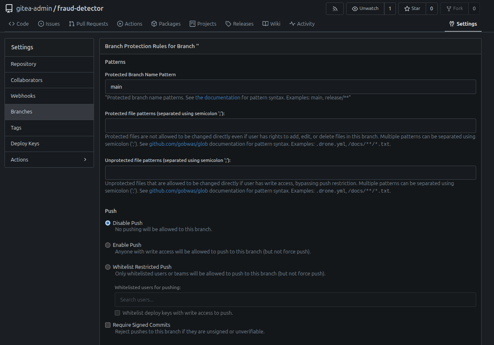
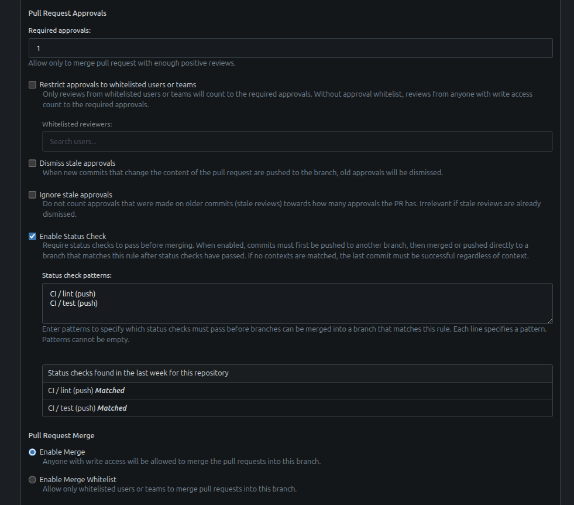

### Task

The xFusionCorp Industries ML platform team is in the process of promoting the `fraud-detector` repository to production governance. A recent incident, in which an administrator force-merged a red pull request, resulted in a one-hour disruption of the `main` branch. This incident highlighted two critical gaps: the Continuous Integration (CI) pipeline only performs linting and does not execute the test suite, and there are no restrictions in place to require contributors to wait for CI checks before merging. Your capstone task is to address both issues. First, enhance the CI pipeline to ensure that it executes the repository's test suite as a `test` check in addition to the existing `lint` check. Next, configure Gitea branch protection rules on the `main` branch to mandate that all future changes must be made through a pull request. This pull request must show successful completion of both the `lint` and `test` checks, as well as receive at least one approving review.

1. The Gitea UI is on port `3000` (**Gitea** button). Admin credentials: `gitea-admin` / `gitea2026`. The repo is at `http://localhost:3000/gitea-admin/fraud-detector`, with a working clone at `/root/code/fraud-detector` (on main).

2. The work has two parts. First, `.gitea/workflows/ci.yml` defines only a `lint` job while the `test` job is left as a `# TODO`; a `test` job that installs the test deps and runs the repo's suite needs to be added and run on `main` at least once, since a status check can only be required once it exists as a context. Second, the `main` branch needs a branch-protection rule (under the repo's **Settings → Branches**) that blocks direct pushes so every change arrives through a PR, requires both the `lint` and `test` status checks, and requires at least `1` approving review.

3. The end state must include:
   - `.gitea/workflows/ci.yml` on `main` defines a `test` job that runs pytest, alongside `lint`.
   - `GET /api/v1/repos/gitea-admin/fraud-detector/branch_protections` returns a rule for main with `enable_status_check: true` and `status_check_contexts` including both a `lint` and a `test` entry.
   - `required_approvals` is at least `1`.
   - Direct push is blocked — either `enable_push: false`, or `enable_push_whitelist: true` with every allow-list empty.

Branch protection is the guardrail production governance depends on: required status checks stop the 'reviewer overrides red CI' pattern, required reviews stop the 'admin merges pre-review on a Friday afternoon' incident, and blocking direct pushes means the only path onto `main` is a reviewed, green pull request—so every change is auditable, revertable, and release-taggable. And you can only require a check that exists, which is why you build the `test` job before you lock the branch behind it.

### Solution

- Change directory

  ```bash
  cd /root/code/fraud-detector/
  ```

- Update the `.gitea/workflows/ci.yml`

  ```yml
  name: CI

  on:
    pull_request:
      branches: [main]
    push:
      branches: [main]

  jobs:
    lint:
      runs-on: ubuntu-latest
      steps:
        - uses: actions/checkout@v4
        - name: Install ruff
          run: pip install --break-system-packages ruff
        - name: Run ruff
          run: ruff check src tests

    # TODO: add a `test` job so the pipeline runs the repo's test suite,
    #       not just lint. Branch protection can only require a status
    #       check that actually exists, so `test` must be a real, run-once
    #       job before you can require it on `main`. The job should:
    #         runs-on: ubuntu-latest
    #         - uses: actions/checkout@v4
    #         - install pytest + runtime deps:
    #             pip install --break-system-packages pytest pandas numpy scikit-learn joblib
    #         - run the suite:
    #             python3 -m pytest tests -v
    test:
      runs-on: ubuntu-latest
      steps:
        - uses: actions/checkout@v4
        - name: Install test dependencies
          run: pip install --break-system-packages pytest pandas numpy scikit-learn joblib
        - name: Run tests
          run: python3 -m pytest tests -v
  ```

- Commit and push the changes

  ```bash
  git add .gitea/workflows/ci.yml
  git commit -m "ci: add pytest test job"
  git push
  ```

- Add branch protection

  ```
  Log into Gitea -> Settings -> Branches -> Branch Protection -> Add New Rule
  ```

  
    
  <br />

  

- Verify

  The following command returns a rule for main with
  - enable_status_check: true
  - status_check_contexts including both a lint and a test entry
  - required_approvals is at least 1
  - Direct push is blocked — either `enable_push: false`, or `enable_push_whitelist: true` with every allow-list empty.

  ```bash
  curl -u gitea-admin:gitea2026 http://localhost:3000/api/v1/repos/gitea-admin/fraud-detector/branch_protections
  ```
