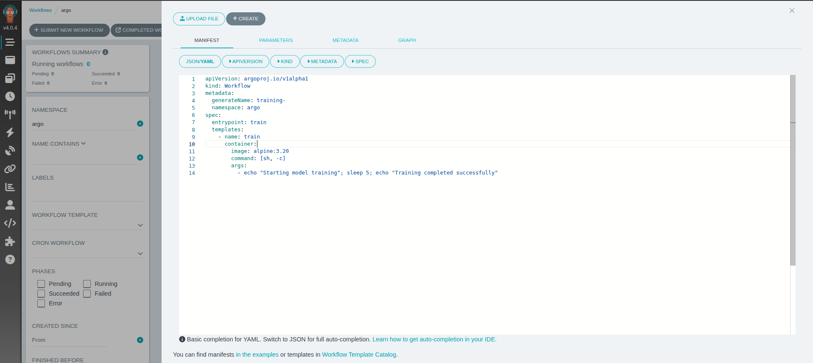
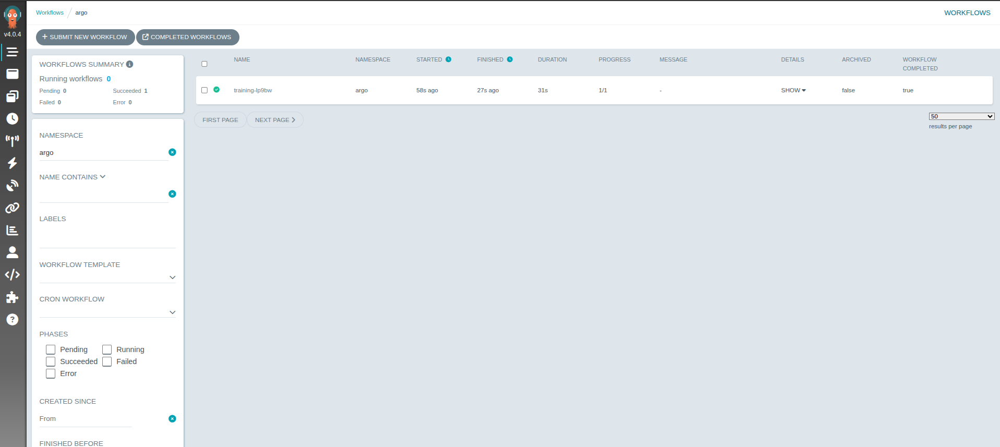

### Task

The xFusionCorp Industries ML platform team has established a new Kubernetes cluster for pipeline orchestration. Argo Workflows v4.0.4 is currently operational in the `argo` namespace, with both the `workflow-controller` and `argo-server` Deployments marked as Available. Additionally, the Argo web UI is accessible via port-forwarding in the lab. Your task is to create your first Argo `Workflow` and submit it using the Argo UI's + **Submit New Workflow** form. This should be a single-step container that simulates a training step and achieves a status of `Succeeded` in the Workflows list.

1. The Argo UI button at the top of the lab opens the Workflows page on port `5000`. The UI has no auth (quick-start install) and the Workflows list is empty on first open; new workflows are authored through its + **Submit New Workflow form**, whose in-browser YAML editor is the canonical authoring surface for this section.

2. The workflow to author is a `kind: Workflow` in namespace `argo` that declares a `spec.entrypoint` pointing at a template under `spec.templates`. That template runs a single `container` whose `command/args` stand in for a training step — an `echo` is fine, since this section teaches orchestration, not model quality. Once submitted, the single node should progress `Pending` → `Running` → `Succeeded`.

3. The end state must include:
   - `GET http://localhost:5000/` returns `200` (Argo UI reachable).
   - `workflow-controller` and `argo-server` Deployments in namespace `argo` are `Available`.
   - At least one `Workflow` exists in namespace `argo`, and the most recent one is genuinely authored: it declares `spec.entrypoint` and a template whose `container` runs a `command/args`.
   - That most recent workflow reaches `status.phase == Succeeded` (tests wait up to 180 s for a terminal phase).

Argo's + Submit New Workflow flow is how every future lab in this section starts. The UI's YAML editor is the canonical authoring surface—not `kubectl apply -f file.yaml` from a terminal. Authoring the Workflow spec by hand here—`entrypoint`, `templates`, `container`—is the foundation every WorkflowTemplate, CronWorkflow, and parameterised pipeline in the coming labs builds on.

### Solution

- Open Argo UI and Create new workflow using **Submit New Workflow**

- Add the manifest

  
    
   

- Verify the results

  
