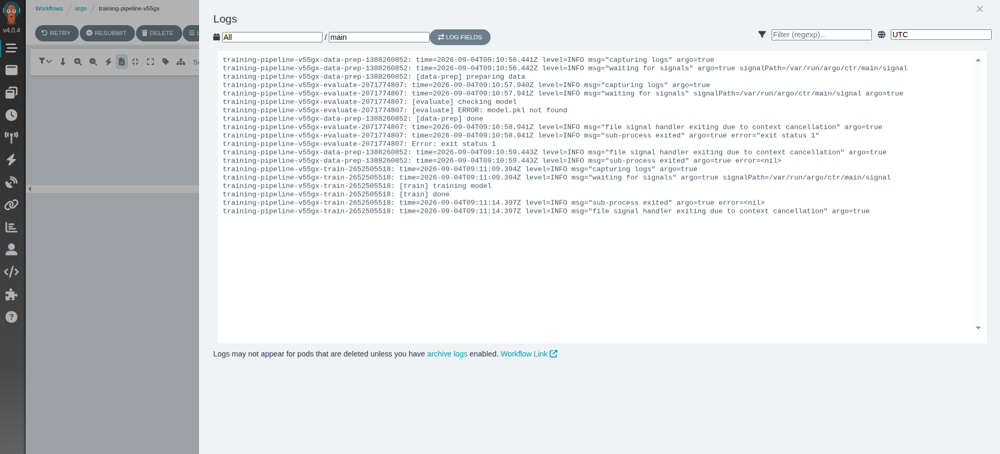

### Task

The xFusionCorp Industries ML platform team has submitted an initial training workflow to Argo — a three-step Directed Acyclic Graph (DAG), `data-prep` → `train` → `evaluate`, whose steps share a workspace volume. This workflow is triggered on every push; however, the current execution is marked red because one of the steps races ahead of its upstream dependency. Your task is to review the broken DAG displayed in the Argo UI, submit a corrected workflow using the YAML editor in the UI, and observe the new execution transition to a successful green `Succeeded` status.

1. The **Argo UI** button at the top of the lab opens the Workflows page on port `5000`. The Workflows list holds the pre-submitted run (`training-pipeline-<suffix>`) in a **Failed** state. Open that run and click the red node to read its logs and the DAG graph — that is where the failure surfaces.

2. The workflow is a `dag` template of three tasks that each run in their own pod and share a workspace volume; the three tasks do not run in the order the pipeline needs. The same spec is staged at `/root/code/pipelines/training-workflow.yaml`.

3. After the corrected workflow is submitted through the UI's YAML editor, the DAG should run `data-prep` → `train` → `evaluate` in order, all three nodes turning green with the workflow phase `Succeeded`.

4. The end state must include:
   - At least two workflows in namespace `argo` (the original broken run plus the fixed resubmit).
   - The corrected workflow's `main` DAG gives the `evaluate` task `dependencies: [train]`, so the three steps run in order rather than in parallel.
   - The most recent workflow's `status.phase == Succeeded` (tests wait up to 240 s).

An Argo `dag` template starts each task the moment its `dependencies` are satisfied, and a task with no dependencies runs immediately. Declaring the right `dependencies` is what turns independently-scheduled pods into an ordered pipeline — without them, a task races its inputs, which is a classic cause of a red DAG run.

### Solution

- Go to the **Argo UI** and find the logs related to the error.

  

  BUG: evaluate has no `dependencies`, so the DAG starts it immediately -- in parallel with data-prep/train -- and it fails because train has not written the model yet.

- Submit new workflow wihth the following manifest.

  ```yaml
  apiVersion: argoproj.io/v1alpha1
  kind: Workflow
  metadata:
    generateName: training-pipeline-
    namespace: argo
    labels:
      lab: day86
  spec:
    entrypoint: main
    volumeClaimTemplates:
      - metadata:
          name: workdir
        spec:
          accessModes: ["ReadWriteOnce"]
          resources:
            requests:
              storage: 64Mi
    templates:
      - name: main
        dag:
          tasks:
            - name: data-prep
              template: data-prep
            - name: train
              template: train
              dependencies: [data-prep]
            - name: evaluate
              template: evaluate
              dependencies: [train]
      - name: data-prep
        container:
          image: alpine:3.19
          command: [sh, -c]
          args:
            - |
              echo "[data-prep] preparing data"
              sleep 2
              echo 'rows=100' > /workdir/data.txt
              echo "[data-prep] done"
          volumeMounts:
            - name: workdir
              mountPath: /workdir
      - name: train
        container:
          image: alpine:3.19
          command: [sh, -c]
          args:
            - |
              echo "[train] training model"
              sleep 5
              echo 'model-v1' > /workdir/model.pkl
              echo "[train] done"
          volumeMounts:
            - name: workdir
              mountPath: /workdir
      - name: evaluate
        container:
          image: alpine:3.19
          command: [sh, -c]
          args:
            - |
              echo "[evaluate] checking model"
              if [ ! -f /workdir/model.pkl ]; then
                echo "[evaluate] ERROR: model.pkl not found"
                exit 1
              fi
              cat /workdir/model.pkl
              echo "[evaluate] done"
          volumeMounts:
            - name: workdir
              mountPath: /workdir
  ```

- Wait until the DAG is successfully completed and verify according to the requirments
