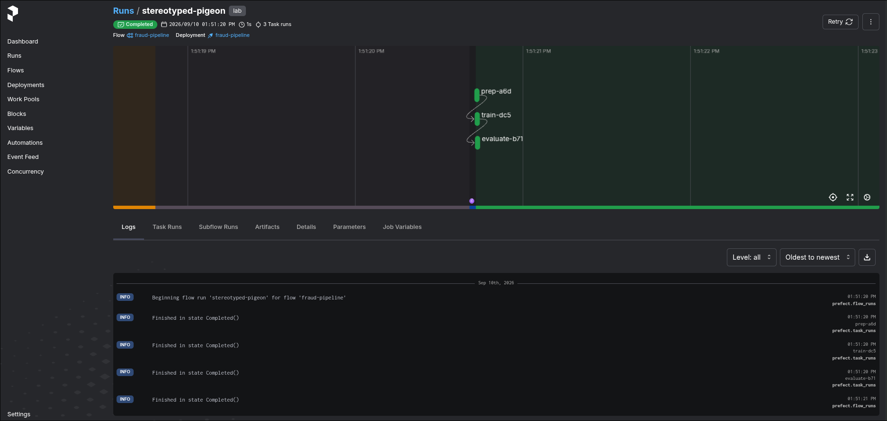

### Task

The xFusionCorp Industries ML platform team is piloting Prefect 3.x as a second orchestrator alongside Argo Workflows. A teammate wired up a `fraud-pipeline` deployment with three steps—`prep`, `train`, `evaluate`—but on every run the Prefect Flow Run graph only shows two tracked nodes (`prep` and `train`); `evaluate` is missing. Your task is to fix the flow source, redeploy, trigger a new run from the Deployments page, and confirm the 3-node DAG.

1. The Prefect UI button at the top of the lab opens the UI on port `5000`. Its Deployments page lists `fraud-pipeline`. Trigger a Quick Run and open the resulting Flow Run: its DAG renders only two nodes, and comparing that graph against the flow source is where the gap shows up.

2. The flow source is at `/root/code/prefect/fraud_pipeline.py`; the `evaluate` function runs as part of the flow but does not surface in the run graph the way the other two functions do. A shipped Makefile in that directory wraps the kill + restart cycle needed for the serve loop to pick up the new source (`/var/log/prefect-serve.log` confirms the new process is up).

3. After redeploying and triggering a fresh Quick Run, the Flow Run's DAG should render three nodes — `prep → train → evaluate` — each reaching Completed.

4. The end state must include:
   - Prefect's `/api/deployments/name/fraud-pipeline/fraud-pipeline` returns the deployment.
   - At least one Completed flow run under that deployment has three task runs whose names are exactly `prep`, `train`, and `evaluate` — Prefect's run graph now records 1evaluate` alongside the other two.

Prefect's flow-run graph is built from the task-run records its orchestrator emits during execution. A function that runs as part of the flow but is not registered as a task disappears from the run graph entirely — it executes, but the orchestrator has no record of it.

### Solution

- Go to Prefect UI

- Trigger a quick run

  ```
  Deployments -> fraud-pipeline - Run -> Quick run
  ```

- Update the `fraud_pipeline.py`

  ```python
  """Prefect 3.x flow for the fraud-detection pipeline.

  Structure: prep -> train -> evaluate. Each step is a `@task`-decorated
  function -- or should be. Inspect the evaluate node on the Prefect UI's
  Flow Run graph to see whether it is being tracked.
  """
  from __future__ import annotations

  from prefect import flow, task


  @task(name="prep")
  def prep() -> dict:
      print("[prep] preparing training data")
      return {"rows": 100, "path": "/tmp/train.csv"}


  @task(name="train")
  def train(data: dict) -> str:
      print(f"[train] fitting model on {data['rows']} rows from {data['path']}")
      return "model-v1"

  @task(name="evaluate")
  def evaluate(model: str) -> float:
      print(f"[evaluate] scoring model {model}")
      return 0.75


  @flow(name="fraud-pipeline")
  def fraud_pipeline() -> float:
      data = prep()
      model = train(data)
      score = evaluate(model)
      print(f"[flow] final score={score}")
      return score


  if __name__ == "__main__":
      # `.serve()` registers a deployment named `fraud-pipeline` and
      # blocks as a worker loop, picking up Quick Run triggers from the
      # Prefect UI.
      fraud_pipeline.serve(name="fraud-pipeline", tags=["lab"])
  ```

- Redeploy

  ```bash
  cd /root/code/prefect/
  make
  ```

- Quick run

- Verify

  The following returns the deployment info.

  ```bash
  curl http://localhost:5000/api/deployments/name/fraud-pipeline/fraud-pipeline
  ```

  The new run should contain all the 3 steps: prep, train, evaluate

  
