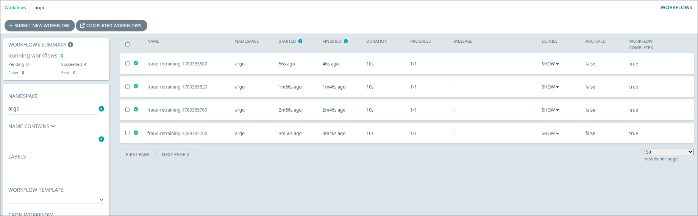

### Task

The xFusionCorp Industries ML platform team requires the `fraud-detector` model to undergo retraining on a fixed schedule without manual intervention. A CronWorkflow scaffold is available at `/root/code/argo/fraud-retraining.yaml`, but it is incomplete; it currently lacks a `schedules` cron expression and the retraining step is only a placeholder. Your objective is to complete the CronWorkflow by adding the appropriate schedule and defining the retraining step. Once completed, apply the CronWorkflow to the `argo` namespace and verify in the Argo UI that it activates and initiates retraining runs as scheduled.

1. The scaffold is at `/root/code/argo/fraud-retraining.yaml`. It is NOT applied yet — the Argo UI's **Cron Workflows** page (port `5000`) stays empty until the CronWorkflow is applied to the `argo` namespace.

2. Two `TODO`-marked pieces are missing from the YAML:
   - **TODO 1 — schedule**: the `schedules`: list with its cron expression is absent, so the cron has no cadence to fire on. It needs to fire frequently enough that a run appears within the grading window (a minute or so).
   - **TODO 2 — retraining step**: the step is only a stub. It should run a stand-in retraining command that exits 0 — an `echo` is enough, since this section teaches orchestration, not model quality.

3. With the CronWorkflow applied, the Cron Workflows page should show `fraud-retraining` active (no Suspended badge) with a `nextScheduledTime` ≤ 60 s out, and within one schedule tick a child Workflow should appear under it and run to **Succeeded**.

4. The end state must include:
   - `GET /api/v1/cron-workflows/argo/fraud-retraining` returns the cron with a non-empty `schedules` and `spec.suspend` not `true`.
   - At least one Workflow labelled `workflows.argoproj.io/cron-workflow=fraud-retraining` (the owner-label Argo adds to every cron-spawned run) reaches `Succeeded`. Tests poll up to 240 s.

A CronWorkflow is Argo's scheduled-run primitive: `schedules` is the cron cadence and `workflowSpec` is the Workflow it fires each tick. This is how retraining runs on autopilot—no human clicking Submit—with `concurrencyPolicy: Forbid` ensuring a slow run never overlaps the next tick.

### Solution

- Update the `/root/code/argo/fraud-retraining.yml`.

  ```yml
  apiVersion: argoproj.io/v1alpha1
  kind: CronWorkflow
  metadata:
    name: fraud-retraining
    namespace: argo
  spec:
    # TODO 1: Schedule the retraining run. Add a `schedules:` list with a
    # cron expression that fires every minute ("* * * * *") so
    # fraud-detector retrains on a fixed cadence.
    schedules:
      - "* * * * *"
    timezone: "Etc/UTC"
    concurrencyPolicy: Forbid
    startingDeadlineSeconds: 60
    successfulJobsHistoryLimit: 4
    failedJobsHistoryLimit: 2
    workflowSpec:
      entrypoint: main
      templates:
        - name: main
          container:
            image: alpine:3.19
            command: [sh, -c]
            args:
              # TODO 2: Author the retraining step this cron runs each
              # tick. Echo a marker containing "retrain" and a UTC
              # timestamp, then exit 0.
              - |
                echo "retrain: $(date -u '+%Y-%m-%dT%H:%M:%SZ')"
                exit 0
  ```

- Apply the CronWorkflow.

  ```bash
  kubectl apply -f /root/code/argo/fraud-retraining.yaml -n argo
  ```

- Verify.

  ```bash
  kubectl get cronworkflow fraud-retraining -n argo
  ```

  The following returns the cron with a non-empty `schedules` and `spec.suspend` not `true`.

  ```bash
  curl http://localhost:5000/api/v1/cron-workflows/argo/fraud-retraining
  ```

  Verify from Argo UI.

  
