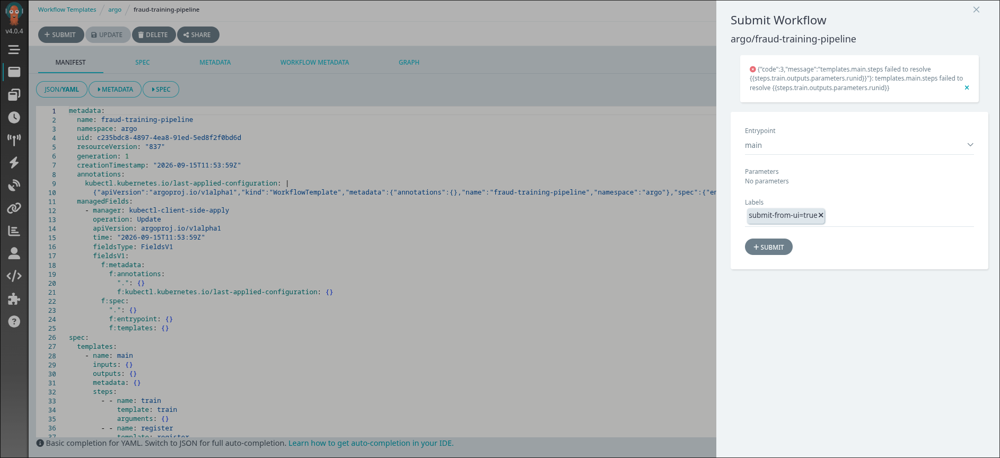
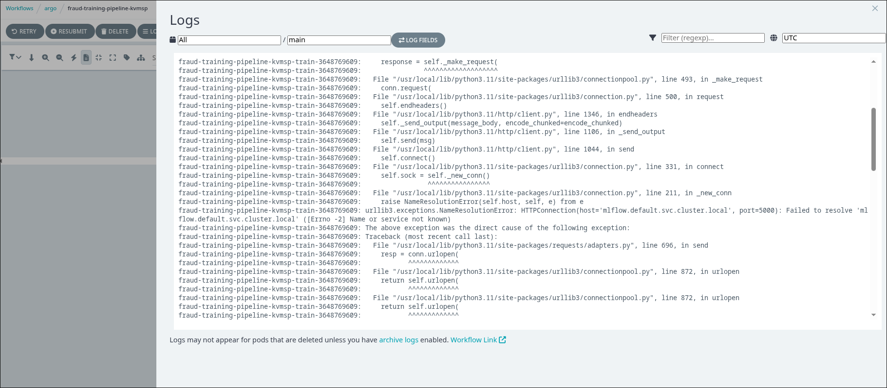
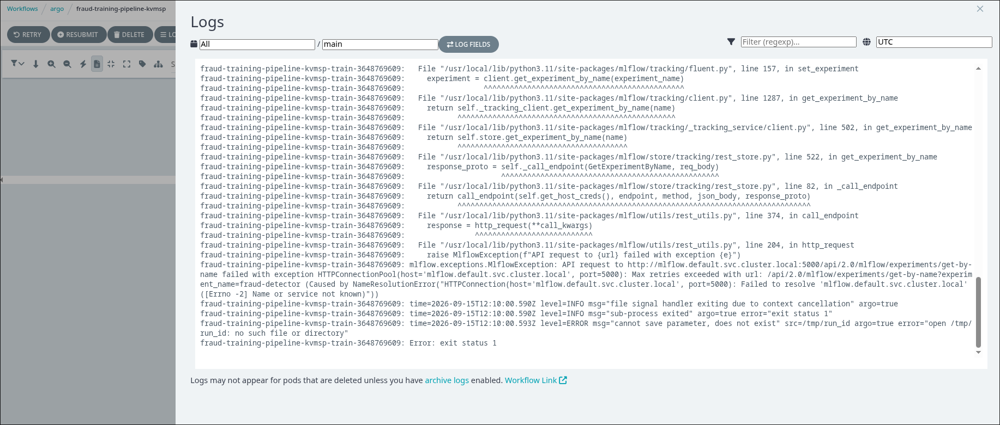
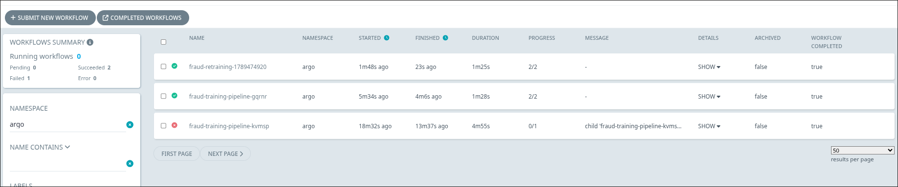
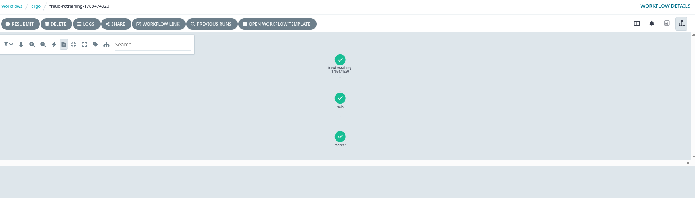
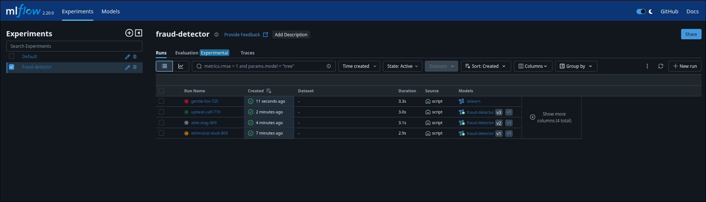

### Task

The xFusionCorp Industries ML platform team is cutting the first production release of the fraud-detector pipeline. A `WorkflowTemplate` named `fraud-training-pipeline` trains a model and registers it in MLflow; a `CronWorkflow` named `fraud-retraining` re-runs the template every minute. Argo and an in-cluster MLflow are running, but the release is broken on three fronts. Your capstone task is to fix all three bugs entirely through the Argo UI and confirm that a new version of `fraud-detector` appears on the MLflow Models page.

1. Two surfaces are exposed: the **Argo UI** (port `5000`) — Workflows list, Workflow Templates, and Cron Workflows — and the **MLflow UI** (port `5001`), whose Models page is empty since no version of `fraud-detector` has been registered yet.

2. Three independent wiring issues sit between the run logs, the `fraud-training-pipeline` WorkflowTemplate spec, and the `fraud-retraining` CronWorkflow spec. They surface progressively: the first submission of the template is rejected outright with a parameter-resolution error (a bad output-parameter reference); once that is fixed a node fails at runtime, visible in its logs; and the Cron Workflows page reveals what `fraud-retraining` is failing to do over the last few minutes. Each fix is a single value change made through the Argo UI's YAML editors (the template's or the cron's Edit view).

3. With all three fixed, a fresh submission of `fraud-training-pipeline` should run green end-to-end, `fraud-retraining` should spawn a green child workflow within a minute, and the MLflow Models page should show one or more versions of `fraud-detector`.

4. The end state must include:
   - A manual submission of the `fraud-training-pipeline` template runs end-to-end to `Succeeded` (`train` and `register` both green on the DAG).
   - `GET /api/2.0/mlflow/registered-models/get?name=fraud-detector` returns at least one version (tests poll up to 300 s).
   - The `fraud-retraining` CronWorkflow spawns at least one child Workflow that completes successfully — the Cron Workflows page shows it in the resource's Workflows panel (tests look for the owner label `workflows.argoproj.io/cron-workflow=fraud-retraining`).

Production orchestration breaks across boundaries — a typo or a stale reference can survive a reviewer's read of any single resource. The capstone is reading them as symptoms on a running system, fixing them in place, and confirming the full pipe is back to passing.

### Solution

- Visit Argo UI and submit the `fraud-training-pipeline` workflow template and identify the error.

  

- Update the `templates.main.steps` as followns

  Replace `runid` with `run_id`

- Submit the tempate again and once that finishes running look at logs

  

  <br />

  

  It shows that the `MLFLOW_TRACKING_URI` is wrong. Find the correct URI.

  ```bash
  # The following will show that in the default namespace there is no mlflow service
  kubectl describe svc mlflow

  # Search all namespaces for mlflow service
  kubectl get svc -A | grep -i mlflow

  # Get information about mlflow service in mlflow namespace
  kubectl describe svc mlflow -n mlflow
  ```

- Fix the namespace issue by updating `MLFLOW_TRACKING_URI` to `http://mlflow.mlflow.svc.cluster.local:5000`.

  The updated workflow template manifest file

  ```yml
  metadata:
    name: fraud-training-pipeline
    namespace: argo
    uid: c235bdc8-4897-4ea8-91ed-5ed8f2f0bd6d
    resourceVersion: "3039"
    generation: 3
    creationTimestamp: "2026-09-15T11:53:59Z"
    labels:
      workflows.argoproj.io/action: Update
      workflows.argoproj.io/actor: system-serviceaccount-argo-argo-server
    annotations:
      kubectl.kubernetes.io/last-applied-configuration: |
        {"apiVersion":"argoproj.io/v1alpha1","kind":"WorkflowTemplate","metadata":{"annotations":{},"name":"fraud-training-pipeline","namespace":"argo"},"spec":{"entrypoint":"main","templates":[{"name":"main","steps":[[{"name":"train","template":"train"}],[{"arguments":{"parameters":[{"name":"run_id","value":"{{steps.train.outputs.parameters.runid}}"}]},"name":"register","template":"register"}]]},{"name":"train","outputs":{"parameters":[{"name":"run_id","valueFrom":{"path":"/tmp/run_id"}}]},"script":{"command":["python"],"env":[{"name":"MLFLOW_TRACKING_URI","value":"http://mlflow.default.svc.cluster.local:5000"}],"image":"python:3.11-slim","source":"import os, subprocess, sys\nsubprocess.check_call([sys.executable, \"-m\", \"pip\", \"install\",\n    \"--quiet\", \"mlflow==2.20.0\", \"scikit-learn\"])\nimport mlflow, mlflow.sklearn\nfrom sklearn.dummy import DummyClassifier\nimport numpy as np\n\nmlflow.set_tracking_uri(os.environ[\"MLFLOW_TRACKING_URI\"])\nmlflow.set_experiment(\"fraud-detector\")\n\nX = np.zeros((20, 4)); y = [0, 1] * 10\nmodel = DummyClassifier(strategy=\"most_frequent\").fit(X, y)\n\nwith mlflow.start_run() as run:\n    mlflow.log_metric(\"f1_score\", 0.82)\n    mlflow.sklearn.log_model(model, artifact_path=\"model\")\n    with open(\"/tmp/run_id\", \"w\") as f:\n        f.write(run.info.run_id)\n    print(f\"[train] run_id={run.info.run_id}\")\n"}},{"inputs":{"parameters":[{"name":"run_id"}]},"name":"register","script":{"command":["python"],"env":[{"name":"MLFLOW_TRACKING_URI","value":"http://mlflow.default.svc.cluster.local:5000"}],"image":"python:3.11-slim","source":"import os, subprocess, sys\nsubprocess.check_call([sys.executable, \"-m\", \"pip\", \"install\",\n    \"--quiet\", \"mlflow==2.20.0\"])\nimport mlflow\nmlflow.set_tracking_uri(os.environ[\"MLFLOW_TRACKING_URI\"])\nrun_id = \"{{inputs.parameters.run_id}}\"\nif not run_id or run_id == \"None\":\n    raise SystemExit(\n        \"register received an empty run_id. \"\n        \"Check the parameter reference on the register step.\"\n    )\nresult = mlflow.register_model(\n    f\"runs:/{run_id}/model\", \"fraud-detector\",\n)\nprint(f\"[register] {result.name} v{result.version}\")\n"}}]}}
    managedFields:
      - manager: kubectl-client-side-apply
        operation: Update
        apiVersion: argoproj.io/v1alpha1
        time: "2026-09-15T11:53:59Z"
        fieldsType: FieldsV1
        fieldsV1:
          f:metadata:
            f:annotations:
              ".": {}
              f:kubectl.kubernetes.io/last-applied-configuration: {}
          f:spec:
            ".": {}
            f:entrypoint: {}
      - manager: argo
        operation: Update
        apiVersion: argoproj.io/v1alpha1
        time: "2026-09-15T12:18:02Z"
        fieldsType: FieldsV1
        fieldsV1:
          f:metadata:
            f:labels:
              ".": {}
              f:workflows.argoproj.io/action: {}
              f:workflows.argoproj.io/actor: {}
          f:spec:
            f:arguments: {}
            f:templates: {}
  spec:
    templates:
      - name: main
        inputs: {}
        outputs: {}
        metadata: {}
        steps:
          - - name: train
              template: train
              arguments: {}
          - - name: register
              template: register
              arguments:
                parameters:
                  - name: run_id
                    value: "{{steps.train.outputs.parameters.run_id}}"
      - name: train
        inputs: {}
        outputs:
          parameters:
            - name: run_id
              valueFrom:
                path: /tmp/run_id
        metadata: {}
        script:
          name: ""
          image: python:3.11-slim
          command:
            - python
          env:
            - name: MLFLOW_TRACKING_URI
              value: http://mlflow.mlflow.svc.cluster.local:5000
          resources: {}
          source: |
            import os, subprocess, sys
            subprocess.check_call([sys.executable, "-m", "pip", "install",
                "--quiet", "mlflow==2.20.0", "scikit-learn"])
            import mlflow, mlflow.sklearn
            from sklearn.dummy import DummyClassifier
            import numpy as np

            mlflow.set_tracking_uri(os.environ["MLFLOW_TRACKING_URI"])
            mlflow.set_experiment("fraud-detector")

            X = np.zeros((20, 4)); y = [0, 1] * 10
            model = DummyClassifier(strategy="most_frequent").fit(X, y)

            with mlflow.start_run() as run:
                mlflow.log_metric("f1_score", 0.82)
                mlflow.sklearn.log_model(model, artifact_path="model")
                with open("/tmp/run_id", "w") as f:
                    f.write(run.info.run_id)
                print(f"[train] run_id={run.info.run_id}")
      - name: register
        inputs:
          parameters:
            - name: run_id
        outputs: {}
        metadata: {}
        script:
          name: ""
          image: python:3.11-slim
          command:
            - python
          env:
            - name: MLFLOW_TRACKING_URI
              value: http://mlflow.mlflow.svc.cluster.local:5000
          resources: {}
          source: |
            import os, subprocess, sys
            subprocess.check_call([sys.executable, "-m", "pip", "install",
                "--quiet", "mlflow==2.20.0"])
            import mlflow
            mlflow.set_tracking_uri(os.environ["MLFLOW_TRACKING_URI"])
            run_id = "{{inputs.parameters.run_id}}"
            if not run_id or run_id == "None":
                raise SystemExit(
                    "register received an empty run_id. "
                    "Check the parameter reference on the register step."
                )
            result = mlflow.register_model(
                f"runs:/{run_id}/model", "fraud-detector",
            )
            print(f"[register] {result.name} v{result.version}")
    entrypoint: main
    arguments: {}
  ```

- Go to Cron Workflows and fix the bug

  The cron workflow bug is wrong workflow template name referred in the cron. Update it to `fraud-training-pipeline`.

  ```
  Cron Workflows -> fraud-retraining -> Manifest
  ```

  ```yml
  metadata:
    name: fraud-retraining
    namespace: argo
    uid: 1d3785df-58a5-451a-9193-1db8f562a2cd
    resourceVersion: "3402"
    generation: 2
    creationTimestamp: "2026-09-15T11:53:59Z"
    labels:
      workflows.argoproj.io/action: Update
      workflows.argoproj.io/actor: system-serviceaccount-argo-argo-server
    annotations:
      kubectl.kubernetes.io/last-applied-configuration: |
        {"apiVersion":"argoproj.io/v1alpha1","kind":"CronWorkflow","metadata":{"annotations":{},"name":"fraud-retraining","namespace":"argo"},"spec":{"concurrencyPolicy":"Forbid","schedules":["* * * * *"],"timezone":"Etc/UTC","workflowSpec":{"workflowTemplateRef":{"name":"training-pipeline"}}}}
    managedFields:
      - manager: kubectl-client-side-apply
        operation: Update
        apiVersion: argoproj.io/v1alpha1
        time: "2026-09-15T11:53:59Z"
        fieldsType: FieldsV1
        fieldsV1:
          f:metadata:
            f:annotations:
              ".": {}
              f:kubectl.kubernetes.io/last-applied-configuration: {}
          f:spec:
            ".": {}
            f:concurrencyPolicy: {}
            f:schedules: {}
            f:timezone: {}
            f:workflowSpec:
              ".": {}
              f:workflowTemplateRef: {}
      - manager: argo
        operation: Update
        apiVersion: argoproj.io/v1alpha1
        time: "2026-09-15T12:21:20Z"
        fieldsType: FieldsV1
        fieldsV1:
          f:metadata:
            f:labels:
              ".": {}
              f:workflows.argoproj.io/action: {}
              f:workflows.argoproj.io/actor: {}
          f:spec:
            f:workflowSpec:
              f:arguments: {}
              f:workflowTemplateRef:
                f:name: {}
          f:status:
            ".": {}
            f:failed: {}
            f:phase: {}
            f:succeeded: {}
  spec:
    workflowSpec:
      arguments: {}
      workflowTemplateRef:
        name: fraud-training-pipeline
    concurrencyPolicy: Forbid
    timezone: Etc/UTC
    schedules:
      - "* * * * *"
  status:
    active: null
    lastScheduledTime: null
    conditions: null
    succeeded: 0
    failed: 0
    phase: ""
  ```

- Verify

  Using the Argo UI

  

  <br />

  

  The following returns at least one version

  ```bash
  curl http://localhost:5001/api/2.0/mlflow/registered-models/get?name=fraud-detector
  ```

  MLflow UI shows the models

  
