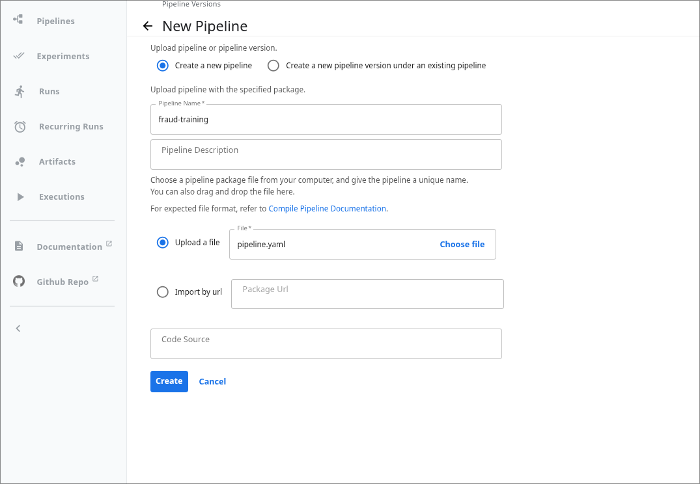
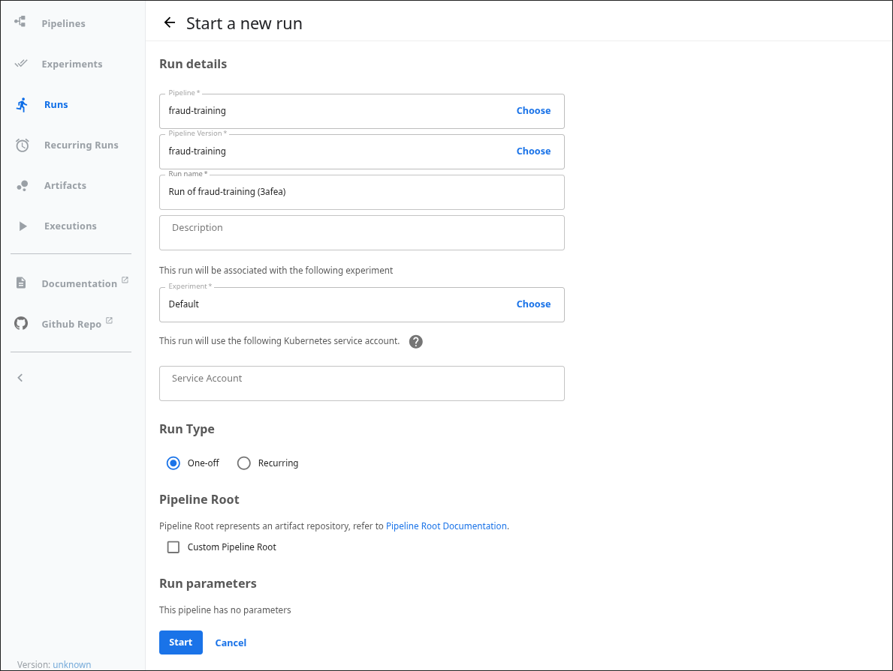
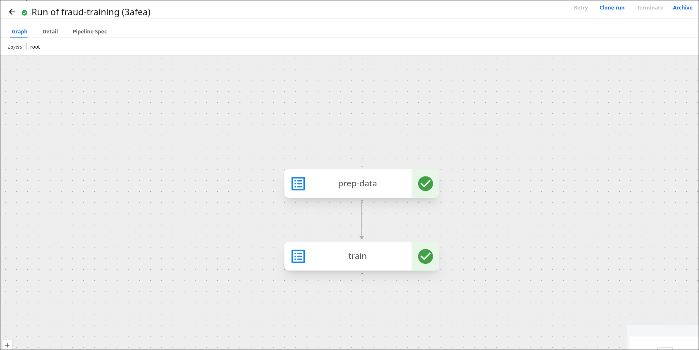

### Task

The xFusionCorp Industries ML platform team is piloting Kubeflow Pipelines on their kind cluster, with the KFP web UI exposed on port `5000`. A two-component pipeline source (`prep_data` → `train`) is staged at `/root/code/kfp/pipeline.py`, but its pipeline function wires only the first component. Your task is to complete the DAG so `train` runs after `prep_data`, compile it to an IR YAML with the KFP SDK, upload it through the KFP UI as `fraud-training`, then create and run it from the Default experiment and confirm the run reaches Succeeded.

1. Kubeflow Pipelines is running on the kind cluster and its UI is exposed via the KFP UI button at the top of the lab (port `5000`). A two-component pipeline source is staged at `/root/code/kfp/pipeline.py`: the `@dsl.component` functions `prep_data` and `train` are written, but `fraud_training_pipeline` wires only `prep_data` — inspect the pipeline function to see what is missing.

2. Compile the source to an IR YAML (the KFP SDK is installed):

   ```bash
   cd /root/code/kfp && python3 pipeline.py
   ```

3. The KFP UI's file picker reads from your local machine, not the lab container, so download the compiled `pipeline.yaml` from the VS Code Explorer before uploading it through the UI.

4. The end state must include:
   - The KFP UI is reachable on `:5000`.
   - `/root/code/kfp/pipeline.py`'s pipeline function wires the `train` component after prep_data.
   - `GET /apis/v2beta1/pipelines` returns a pipeline named `fraud-training`.
   - At least one run from that pipeline reaches state `SUCCEEDED` (tests poll up to 420 s).

KFP compiles each `@dsl.component` into one container-per-step; the `@dsl.pipeline` function is the DAG that wires them, and `python3 pipeline.py` runs the compiler to produce the IR YAML the KFP UI executes. Components run in parallel unless an explicit ordering edge declares a dependency.

### Solution

- Update the `/root/code/kfp/pipeline.py`.

  ```python
  """Two-component Kubeflow Pipelines v2 source.

  Structure: ``prep_data`` → ``train``. Each component runs as its own
  pod on the kind cluster managed by Kubeflow Pipelines. The pipeline
  function below is unfinished -- it wires only the first component.
  Complete the DAG, then compile this file to ``pipeline.yaml``
  (``python3 pipeline.py``) and upload that artefact through the KFP UI.
  """
  from kfp import compiler, dsl

  PIPELINE_NAME = "fraud-training"


  @dsl.component(base_image="python:3.11-slim")
  def prep_data():
      print("[prep_data] synthesising training data: synthetic-rows=100")


  @dsl.component(base_image="python:3.11-slim")
  def train():
      print("[train] training on synthetic data -> model artefact ready")


  @dsl.pipeline(
      name=PIPELINE_NAME,
      description="Synthetic two-step training pipeline for the KFP lab.",
  )
  def fraud_training_pipeline():
      prep = prep_data()
      # TODO: Complete the DAG. Call the `train` component and make it run
      # AFTER `prep_data` -- KFP runs components in parallel unless you
      # declare a dependency. Chain the ordering with `.after(prep)`.
      train().after(prep)


  if __name__ == "__main__":
      compiler.Compiler().compile(
          pipeline_func=fraud_training_pipeline,
          package_path="pipeline.yaml",
      )
      print("Wrote pipeline.yaml -- upload this file via the KFP UI.")
  ```

- Compile and download the compiled file.

  ```bash
  cd /root/code/kfp/ && python3 pipeline.py
  ```

- Upload the compiled file to KFP UI.

  ```
  KFP UI -> Pipelines -> Upload pipeline
  ```

  

- Run the pipeline.

  ```
  Pipelines -> fraud-training -> Create run
  ```

  

- Verify

  The following returns a pipeline named `fraud-training`.

  ```bash
  curl http://localhost:5000/apis/v2beta1/pipelines
  ```

  At least one run from that pipeline reaches state SUCCEEDED.

  
