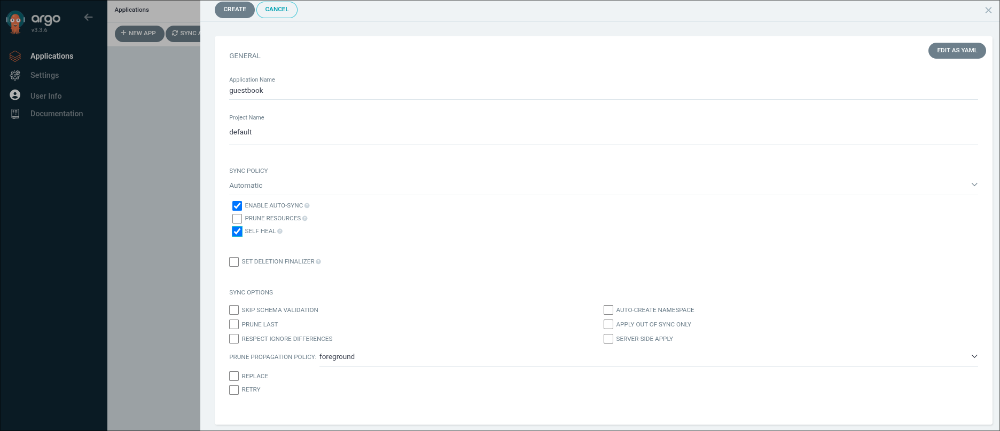
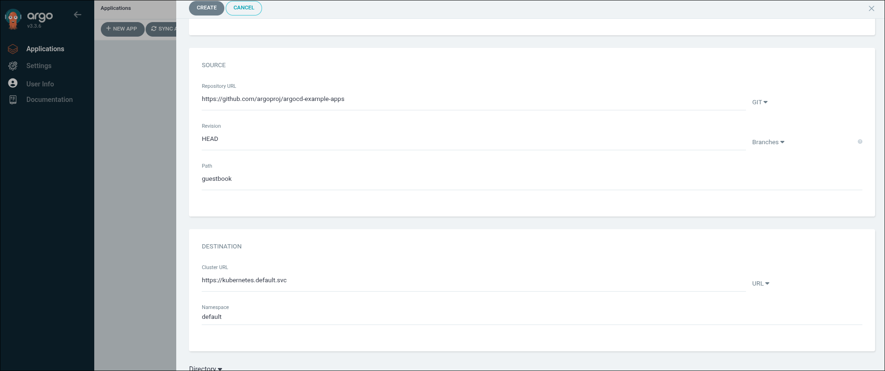
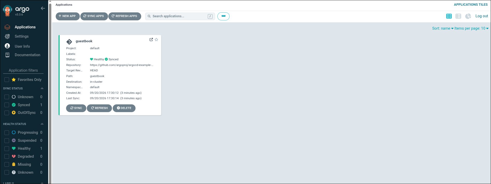

### Task

The xFusionCorp Industries ML platform team is adopting GitOps for their Kubernetes workloads: every deployable resource lives in a git repo, and ArgoCD keeps the cluster reconciled against that repo. ArgoCD v3.3.6 is already running on the `mlops` kind cluster and the UI is reachable on port `5000`. Your task is to use the UI to create an Application named `guestbook` pointing at the canonical `argoproj/argocd-example-apps` guestbook path—a small stand-in workload, since the GitOps reconcile loop you are practising is model-agnostic—sync it, and confirm that the cluster matches the repo.

1. ArgoCD is running on the `mlops` kind cluster and its UI is exposed via the ArgoCD UI button at the top of the lab (port `5000`); log in as `admin` / `admin`. From the UI, create an Application named `guestbook` (project `default`) that tracks the guestbook path of `https://github.com/argoproj/argocd-example-apps` at revision `HEAD`, deploying to the default namespace of `https://kubernetes.default.svc`. Enable automatic sync so ArgoCD reconciles the cluster to the repo without manual syncing, then confirm the app converges.

2. The end state must include:
   - `GET /api/v1/applications/guestbook` (after auth) returns an Application.
   - `spec.source.repoURL` resolves to `https://github.com/argoproj/argocd-example-apps`.
   - `spec.source.path == "guestbook"`.
   - `status.sync.status == "Synced"` AND `status.health.status == "Healthy"` (tests poll up to 240 s).

GitOps is declarative deployment with git as the source of truth: you describe the desired cluster state in a repo, and ArgoCD's controller loop reconciles the real cluster to match. Automatic sync + self-heal means any drift (a teammate `kubectl delete`ing a pod, say) is corrected within one reconciliation cycle without a human clicking a button.

### Solution

- Log into ArgoCD UI.

- Create application.

  ```
  Applications -> Create Application
  ```

  

  <br />

  

- Verify.

  
