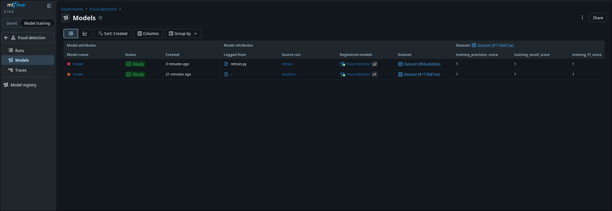

### Task

The xFusionCorp Industries MLOps team is operating a fraud-detector in production. The live transaction stream has shifted away from the distribution the deployed model was trained on. `fraud-detector` is at **version 1** with the `production` alias. Your task is to build the automated retraining loop: complete `retrain_if_drift.py` so it detects drift and—only when the data has drifted—retrains on the combined data, registers the new run as a new version, and moves the `production` alias to it. Then run it and confirm version 2 is live.

1. The **MLflow UI** (port `5000`), **Drift Report** (port `8086`), and **SeaweedFS Filer** (port `8888`) buttons at the top of the lab open the relevant UIs. Pre-staged state:
   - MLflow tracking server on `:5000` (SQLite metadata, SeaweedFS artefacts at `:8333` / Filer `:8888`).
   - Registered model `fraud-detector` at version 1 with the `production` alias (trained on `reference.csv`).
   - `/root/code/data/` holds `reference.csv` + `current.csv` (the shifted stream).
   - A static-file server on `:8086` (the **Drift Report** button) serves `/root/code/reports/` — empty until the loop generates `drift.html`.
   - Reference scripts under `/root/code/`: `drift.py` (Evidently drift → `drift.html` + `drift-summary.json`) and `retrain.py` (logs a `retrain` run to MLflow). Neither needs editing.
   - `/root/code/retrain_if_drift.py` is scaffolded: the plumbing (running drift.py/retrain.py, finding the new run id) is written, with two `TODO` markers left for you to complete.

2. The end state must include:
   - `/root/code/retrain_if_drift.py` registers a new version and moves the alias in code (the automation).
   - `/root/code/reports/drift.html` exists; the Evidently summary records `dataset_drift=True`.
   - The `fraud-detection` experiment contains a run named `retrain`.
   - The registered model `fraud-detector` has **at least version 2**, sourced from the `retrain` run.
   - The `production` alias on `fraud-detector` points at version 2 (or higher) — no longer at version 1.

Drift-triggered retraining is the closed loop of production ML: a monitor quantifies the shift, a gate decides whether retraining is warranted, and promotion swaps the serving alias to the new version. Wiring detect → retrain → promote into one script is the difference between 'we retrain when someone notices' and 'the system retrains itself'.

### Solution

- Update `/root/code/retrain_if_drift.py`.

  ```python
  """Drift-triggered retraining for fraud-detector.

  One command closes the loop: detect drift -> (only if drifted) retrain
  on the combined data -> register the new run as a `fraud-detector`
  version -> move the `production` alias to it. This is the "automated
  retraining" the lab is about -- no manual clicking in the MLflow UI.

  The plumbing to run the provided drift/retrain scripts and to find the
  new run id is written for you. Author the two TODOs.
  """
  from __future__ import annotations

  import json
  import subprocess
  import sys
  from pathlib import Path

  import mlflow

  HERE = Path(__file__).resolve().parent
  TRACKING_URI = "http://localhost:5000"
  MODEL_NAME = "fraud-detector"
  ALIAS = "production"

  mlflow.set_tracking_uri(TRACKING_URI)
  client = mlflow.tracking.MlflowClient()


  def _run(script: str) -> None:
      """Run one of the provided scripts (drift.py / retrain.py)."""
      subprocess.check_call([sys.executable, str(HERE / script)])


  def _latest_retrain_run_id() -> str:
      exp = client.get_experiment_by_name("fraud-detection")
      runs = client.search_runs(
          [exp.experiment_id],
          filter_string="tags.mlflow.runName = 'retrain'",
          order_by=["attributes.start_time DESC"],
          max_results=1,
      )
      if not runs:
          raise SystemExit("no `retrain` run found after retraining")
      return runs[0].info.run_id


  # --- 1. Detect drift (writes reports/drift-summary.json + drift.html).
  _run("drift.py")
  summary = json.loads((HERE / "reports" / "drift-summary.json").read_text())
  drifted = bool(summary.get("dataset_drift"))
  print(f"[loop] dataset_drift={drifted}")

  # TODO 1: Gate retraining on drift. If the model has NOT drifted, print
  # that no retraining is needed and exit 0 -- do not retrain or promote.
  # (Only reach the steps below when drifted is True.)
  if not drifted:
      print(f"[loop] no drift detected; retraining not needed")
      raise SystemExit(0)

  # --- 2. Retrain on the combined data (logs a `retrain` run to MLflow).
  _run("retrain.py")
  run_id = _latest_retrain_run_id()
  print(f"[loop] retrained: run_id={run_id}")

  # TODO 2: Promote the retrained model automatically. Register
  # runs:/<run_id>/model as a new version of MODEL_NAME, then move the
  # ALIAS (`production`) onto that new version so the serving layer picks
  # it up -- use mlflow.register_model(...) and
  # client.set_registered_model_alias(...).
  model_uri = f"runs:/{run_id}/model"
  registered_model = mlflow.register_model(model_uri=model_uri, name=MODEL_NAME)
  client.set_registered_model_alias(name=MODEL_NAME, alias=ALIAS, version=registered_model.version)

  print(f"[loop] registered {MODEL_NAME} version={registered_model.version}")
  print(f"[loop] alias {ALIAS} -> version {registered_model.version}")

  ```

- Run the script.

  ```bash
  python3 /root/code/retrain_if_drift.py
  ```

- Verify.

  `/root/code/reports/drift.html` exists; the Evidently summary records `dataset_drift=True`.

  Verify the following from the **MLflow UI**.

  The fraud-detection experiment contains a run named retrain.

  The registered model fraud-detector has at least version 2, sourced from the retrain run.

  The production alias on fraud-detector points at version 2 (or higher) — no longer at version 1.

  
